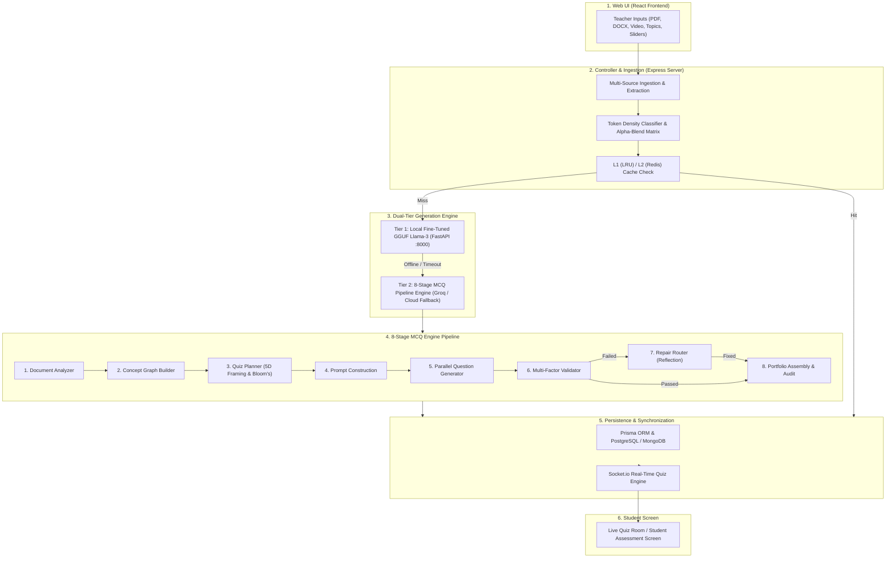

# Comprehensive Technical Pipeline Architecture Document
## From Teacher Input to Student Screen: End-to-End MCQ Generation & Real-Time Live Quiz Platform

---

## 1. System High-Level Overview

This system is an enterprise-grade academic quiz platform designed for high-density educational content processing, deterministic multi-agent question generation, strict quality validation, and real-time live assessment.



---

## 2. Ingestion & Pre-Processing Pipeline

### 2.1 Multi-Format Document Text Extraction
The system ingests heterogeneous course materials via `server/controllers/quizController.js`:
* **PDF Files**: Extracted using `pdf-parse`. If text output $< 100$ characters (e.g. scanned/binary PDF), the system executes a binary ASCII regex fallback matching `[\x20-\x7E\s]{4,}`.
* **DOCX Files**: Raw XML text extracted via `mammoth`.
* **PPTX / XLSX**: Parsed via `officeParser`.
* **Handwritten Scans / Images**: Converted to `base64` and passed to OCR / Vision pipeline.

### 2.2 YouTube Video Content Synthesis
If a YouTube URL is provided, the ingestion engine uses a 4-tier fallback chain:
1. **Subtitles / Transcript Scraping** (`youtube-transcript`).
2. **oEmbed Public Metadata** (`https://noembed.com/embed?url=...`).
3. **Gemini AI Summarization** (`gemini-1.5-flash`).
4. **Groq AI Educational Summarization** (`llama-3.1-8b-instant`).

---

## 3. Mathematical & Algorithmic Foundations

### 3.1 Factual Token Density Metric ($D$)
Before question generation, the system measures the technical density of the context to auto-adjust question distributions.

$$D = \frac{N_{\text{numbers}} + N_{\text{formulas}} + N_{\text{code\_tokens}} + N_{\text{jargon}}}{N_{\text{total\_tokens}}}$$

Where:
* $N_{\text{numbers}}$ = Count of numeric values and quantitative metrics.
* $N_{\text{formulas}}$ = Count of mathematical expressions ($=, +, -, \times, \div, \sum, \int$).
* $N_{\text{code\_tokens}}$ = Syntax keywords (`def`, `function`, `class`, `import`, `return`, `SELECT`, `WHERE`).
* $N_{\text{jargon}}$ = Academic domain terms matching the curriculum lexicon.

### 3.2 Alpha-Blend Dynamic Weight Allocation Matrix
Teachers set slider preferences ($W_{\text{teacher}}$) for question types:
* `CONCEPTS_AND_DEFINITIONS` (Core Theory)
* `COMPARISONS_AND_TRADEOFFS` (Analytical Reasoning)
* `FORMULAS_AND_CALCULATIONS` (Numerical Design)
* `CASE_STUDIES_AND_SCENARIOS` (Real-World Application)
* `PRACTICAL_AND_LAB_TASKS` (Implementation Synthesis)

The final target ratio $W_{\text{final}}$ blends teacher preference with calculated token density $D$:

$$W_{\text{final}} = \alpha \cdot W_{\text{teacher}} + (1 - \alpha) \cdot W_{\text{classified}}$$

* **Alpha ($\alpha$)**: Weight factor (default $= 0.50$).
* **Hard Zero Rule**: If $W_{\text{teacher}} = 0.0$, then $W_{\text{final}} = 0.0$ strictly (honoring teacher exclusions).

---

## 4. The 8-Stage MCQ Pipeline Engine (`mcqEngine.js`)

```
Stage 1: Document Analysis & Noise Guardrail
   │
Stage 2: Concept Graph Construction & Centrality Ranking
   │
Stage 3: Quiz Planner (5D Framing Rotation & Bloom's Mapping)
   │
Stage 4: Prompt Construction & Exemplar Injection
   │
Stage 5: Parallel Question Generation (Circuit Breaker & Rate Limiter)
   │
Stage 6: Multi-Factor Quality & Grounding Validation
   ├── [Pass] ──────────────────────────┐
   └── [Fail] ──> Stage 7: Repair Router │
                     (Reflection Loop)  │
                            │           │
                            ▼           ▼
                  Stage 8: Portfolio Assembly & Diversity Audit
```

### Stage 1: Document Analyzer & Noise Guardrail
* Evaluates academic density score ($S_{\text{academic}} \ge 0.80$).
* Filters administrative syllabus noise (e.g., "office hours", "grading policy", "zoom links").

### Stage 2: Concept Graph Builder
* Constructs a DAG (Directed Acyclic Graph) of concepts ($V$) and dependencies ($E$).
* Computes importance scores using PageRank-style graph centrality:

$$I(v) = \frac{1 - d}{|V|} + d \sum_{u \in \text{In}(v)} \frac{I(u)}{|\text{Out}(u)|}$$

### Stage 3: Quiz Planner (5D Framing & Bloom's Alignment)
* **Bloom's Taxonomy Profile Allocation**:
  * **EASY**: `RECALL` (Definitions, facts)
  * **MEDIUM**: `APPLY` (Scenarios, computations)
  * **HARD**: `ANALYZE` (Diagnostics, trade-offs)
* **5D Framing Rotation**: Round-robin allocation across 4 distinct stem patterns (`Conceptual`, `Scenario`, `Diagnostic`, `Trade-Off`) to guarantee stem structure diversity.

### Stage 4: Prompt Construction (Constraint Injection)
Applies 10 strict generation rules:
1. Grounding in source snippet.
2. Fallback route on insufficient evidence.
3. Plausible distractors derived from distractor style.
4. No meta-options (*"All of the above"*, *"None of the above"*).
5. Character length limit.
6. Exact verbatim source quotation.
7. System-attached evidence bounds.
8. Multiline & code formatting preservation (`\n`).
9. Self-contained stems (anti-meta reference to document layout).
10. **Stem Opening Diversity**: Dynamically varies stem phrasing to prevent formulaic repetitive openings.

### Stage 5: Parallel Question Generation
* Manages concurrent LLM API requests with token-bucket rate limiting ($60 \text{ RPM}$) and exponential backoff jitter:

$$t_{\text{backoff}} = \min(t_{\text{max}}, t_{\text{base}} \times 2^{\text{attempt}}) \times (1 \pm \text{Jitter})$$

### Stage 6: Multi-Factor Quality Validation
Each candidate question is scored across 3 mandatory validation checks:
1. **Grounding Score ($S_{\text{grounding}}$)**:

$$S_{\text{grounding}} = \frac{|\text{Tokens}_{\text{explanation}} \cap \text{Tokens}_{\text{source}}|}{|\text{Tokens}_{\text{explanation}}|}$$

   * Target threshold: $S_{\text{grounding}} \ge 0.85$.
2. **Distractor Jaccard Similarity ($J$)**:

$$J(A, B) = \frac{|A \cap B|}{|A \cup B|}$$

   * Must be $< 0.85$ to prevent duplicate/overlapping options.
3. **Option Length Variance**: Ensures correct answer length does not systematically outlier from distractors.

### Stage 7: Repair Router (Reflection & Self-Correction)
* If an item fails validation, it is **not** discarded blindly.
* The Repair Router generates a targeted critique prompt containing:
  * The original candidate question.
  * The specific failure reasons (e.g. `DISTRACTOR_OVERLAP`, `MISSING_EVIDENCE`).
  * Explicit instructions to rewrite only the flawed field.

### Stage 8: Portfolio Assembly & Diversity Audit
* **Answer Key Balancer**: Distributes correct answers evenly across options $A, B, C, D$ ($\approx 25\%$ per letter).
* **Stem Opening Audit**: Limits identical 3-word stem opening signatures to $\le 25\%$ of total quiz questions.
* **Difficulty Ramp Sorter**: Orders questions progressively from Easy $\rightarrow$ Medium $\rightarrow$ Hard for optimal student engagement.

---

## 5. Two-Tier Caching Architecture (L1 & L2)

To eliminate latency and API costs for repeated requests, the system implements a two-tier caching framework:

```
Request ──> [L1 In-Memory LRU Cache] ──(Hit <5ms)──> Return Quiz
                 │
               (Miss)
                 ▼
           [L2 Redis Cache] ───────────(Hit <25ms)─> Return Quiz
                 │
               (Miss)
                 ▼
           Execute Pipeline & Write to L1 + L2
```

### Deterministic SHA-256 Cache Key Formula
$$\text{CacheKey} = \text{SHA256}(\text{schema\_ver} \| \text{pipeline\_ver} \| \text{ocr\_ver} \| \text{content\_hash} \| \text{count} \| \text{difficulty})$$

* **L1 Cache**: In-Memory LRU Cache ($1,000$ entries, $30 \text{ sec}$ TTL for health checks).
* **L2 Cache**: Redis / Persistent Hash Store (stores aggregated analysis and finalized quiz JSONs).

---

## 6. Real-Time Synchronization & Student Screen Rendering

### 6.1 Async Background Task Dispatcher
1. Teacher clicks **Generate Quiz**.
2. Server immediately responds with `{ taskId: "task_123" }` (non-blocking).
3. React UI polls `/api/quiz/generate/status/task_123` while rendering real-time progress steps (`Processing Video` $\rightarrow$ `Building Concept Graph` $\rightarrow$ `Generating Questions` $\rightarrow$ `Auditing Diversity`).

### 6.2 Socket.io Live Quiz Engine
When a live host session begins:
* **Host Room Broadcast**: `JOIN_ROOM` with pin code.
* **State Engine**: Broadcasts `QUIZ_STATE_SYNC` containing question timers, current question payload, and participant count.
* **Student Submission**: `SUBMIT_ANSWER` evaluates answer correctness server-side with strict execution time tracking:

$$\text{Score} = \text{BasePoints} \times \left(1 - \frac{t_{\text{elapsed}}}{2 \cdot t_{\text{total}}}\right)$$

* **Leaderboard Update**: Live ranking updates pushed instantly via WebSockets to student and host screens.

### 6.3 Student Screen Rendering Features
* **MathJax / KaTeX**: Renders LaTeX formulas ($E = mc^2$, matrices, integrals).
* **Syntax Highlighter**: Formats code snippets with language detection and line numbers.
* **Self-Contained Option Shuffling**: Options are randomized per student to maintain assessment integrity.

---

## 7. Summary Table of Key System Metrics

| Component | Metric / Formula | Target Value |
| :--- | :--- | :--- |
| **Academic Density** | Noise regex ratio | $\ge 0.80$ |
| **Grounding Score** | $S_{\text{grounding}} = \frac{|\text{Tokens}_{\text{exp}} \cap \text{Tokens}_{\text{source}}|}{|\text{Tokens}_{\text{exp}}|}$ | $\ge 0.85$ |
| **Distractor Similarity** | Jaccard Index $J(A,B)$ | $< 0.85$ |
| **Rate Limit** | Token Bucket RPM | $60 \text{ RPM}$ |
| **Answer Key Balance** | Max option concentration | $\le 35\%$ per letter ($A/B/C/D$) |
| **Stem Opening Diversity** | Max signature repetition ratio | $\le 25\%$ of total quiz |
| **Cache Lookup Latency** | L1 LRU Hit / L2 Redis Hit | $< 5\text{ms}$ / $< 25\text{ms}$ |
