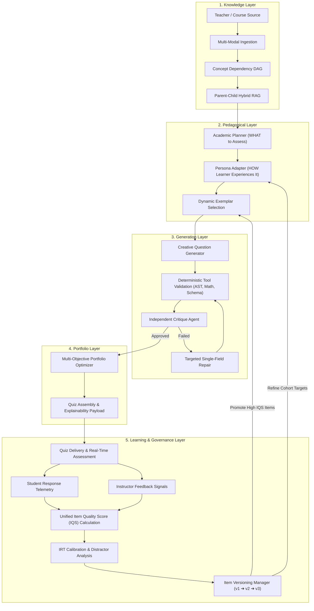

# Master System Architecture Specification 2026
## Enterprise 5-Layer AI MCQ Assessment & Governance Engine

---

## 1. Executive Architectural Summary

This specification defines a production-grade, closed-loop AI assessment platform. The architecture cleanly separates deterministic governance from creative generation, decouples content retrieval from learner adaptation, formulates portfolio assembly as a constrained mathematical optimization problem, and closes the loop via a **Dual-Feedback Calibration Engine** combining Item Response Theory (IRT) and structured instructor telemetry.

```
                         THE 5-LAYER ENTERPRISE ARCHITECTURE

 ┌─────────────────────────────────────────────────────────────────────────────┐
 │ 1. KNOWLEDGE LAYER                                                          │
 │    Multi-Modal Ingestion ──► Concept Dependency Graph ──► Parent-Child RAG    │
 ├─────────────────────────────────────────────────────────────────────────────┤
 │ 2. PEDAGOGICAL LAYER                                                        │
 │    Learning Objectives ──► Academic Planning ──► Persona Adaptation       │
 │    ──► Dynamic Exemplar Selection                                           │
 ├─────────────────────────────────────────────────────────────────────────────┤
 │ 3. GENERATION LAYER                                                         │
 │    Creative Question Generator ──► Deterministic Tools (AST/Math/Schema)    │
 │    ──► Independent Critique Agent ──► Targeted Single-Field Repair          │
 ├─────────────────────────────────────────────────────────────────────────────┤
 │ 4. PORTFOLIO LAYER                                                          │
 │    Constrained Multi-Objective Portfolio Optimizer ──► Difficulty Ramp     │
 │    ──► Quiz Assembly                                                        │
 ├─────────────────────────────────────────────────────────────────────────────┤
 │ 5. LEARNING & GOVERNANCE LAYER                                              │
 │    Quiz Delivery ──► Student Response Analytics ──► IRT Item Calibration    │
 │    ──► Teacher Feedback Signals ──► Item Versioning ──► IQS Exemplar Promotion│
 └─────────────────────────────────────────────────────────────────────────────┘
```

---

## 2. End-to-End Information Flow



---

## 3. Layer-by-Layer Architectural Specification

### 3.1 Layer 1: Knowledge Layer
* **Multi-Modal Ingestion**: Ingests PDFs, DOCX, PPTX, OCR Scans, Audio Transcripts, and Code Repositories. Strips administrative syllabus noise.
* **Concept Dependency Graph (DAG)**: Constructs a Directed Acyclic Graph ($V, E$) representing prerequisite topologies ($A \rightarrow B \rightarrow C$). Ranks concepts by prerequisite depth and curriculum importance.
* **Parent-Child Hybrid RAG**:
  * **Retrieval Vector**: Matches small 200-character child passages for high vector precision.
  * **Context Payload**: Attaches the full 2,000-word parent section to supply rich, un-truncated narrative context.
  * **Isolation**: Content retrieval depends **only** on topic, syllabus, and document context—never on student ability.

### 3.2 Layer 2: Pedagogical Layer
Decouples core curriculum planning from learner-specific adaptation:

1. **Academic Planner (*WHAT to Assess*)**:
   * Analyzes curriculum requirements and outputs an **Assessment Plan**:
     ```json
     {
       "concept": "Sliding Window Protocol",
       "target_bloom": "ANALYZE",
       "learning_objective": "Evaluate timeout behavior under delayed ACK scenarios",
       "evidence_bounds": "Section 4.3: Sliding Window RTT Estimation"
     }
     ```
2. **Persona Adapter (*HOW Learner Experiences It*)**:
   * Accepts the Assessment Plan + Learner Profile Vector $\vec{L} = [\text{Cohort}, \theta_s, \text{Weakness}, \text{Misconception}]$ and outputs the **Final Assessment Brief**:
     ```json
     {
       "assessment_plan": { "concept": "Sliding Window Protocol", "target_bloom": "ANALYZE" },
       "learner_persona": {
         "cohort": "2nd Year Computer Science",
         "target_difficulty": "Medium+",
         "misconception_focus": "Confusing ACK loss timeout with frame corruption"
       }
     }
     ```
3. **Dynamic Exemplar Selection**:
   * Retrieves 2 high-IQS gold-standard questions from the **Exemplar Library** matching the domain (CS, Medical, Law, Finance) as in-context demonstrations.

### 3.3 Layer 3: Generation Layer
* **Creative Question Generator**: Accepts the Final Assessment Brief and generates the stem, options, correct answer, and explanation.
  * **Boundary**: **100% LINGUISTIC FREEDOM**. Internal model reasoning is unconstrained; no explicit system scratchpad artifacts or sentence length rules.
* **Deterministic Tool Validation**:
  * **AST / Code Sandbox**: Executes code blocks in an isolated runtime environment to verify syntax correctness and execution output.
  * **SymPy Parser**: Validates LaTeX mathematical equations.
  * **Schema Guard**: Enforces strict JSON return types.
* **Independent Critique Agent**: Decoupled evaluator checking factual alignment against evidence bounds and distractor plausibility.
* **Targeted Single-Field Repair**: Re-prompts the generator to rewrite *only* flawed fields (e.g. Option C) without regenerating approved components.

### 3.4 Layer 4: Portfolio Layer
Replaces independent heuristic rules with a **Constrained Multi-Objective Optimization Problem**.

#### Mathematical Optimization Formulation:
$$\text{Maximize } U(P) = w_1 \cdot C(P) + w_2 \cdot B(P) + w_3 \cdot N(P) + w_4 \cdot H_L(P) + w_5 \cdot H_A(P)$$

Where:
* $C(P)$ = Concept Coverage Ratio across curriculum DAG.
* $B(P)$ = Bloom's Taxonomy Distribution Match Score.
* $N(P)$ = Narrative Scenario Diversity (vector distance between stems).
* $H_L(P)$ = Lexical Entropy (prevents repetitive stem opening signatures).
* $H_A(P)$ = Answer Key Entropy (balances A, B, C, D correct positions).

$$\text{Subject to Constraints: } \quad N_{\text{questions}} = K, \quad T_{\text{total}} \le T_{\text{limit}}, \quad \text{Prerequisite Order Preserved}$$

* **Instructor Explainability Meta-Payload**: Attaches a transparent, human-readable justification to every generated item:
  ```json
  {
    "question_id": "Q_42",
    "explainability": {
      "target_concept": "Sliding Window Protocol",
      "retained_evidence": "Section 4.3 (Page 112)",
      "learning_objective": "Analyze timeout recovery",
      "target_bloom": "ANALYZE",
      "targeted_misconception": "ACK loss vs frame corruption",
      "assigned_difficulty": "Hard"
    }
  }
  ```

### 3.5 Layer 5: Learning & Governance Layer (Closed-Loop Calibration)
Closes the loop by capturing both student response analytics and structured instructor feedback.

```
                           DUAL-FEEDBACK CALIBRATION LOOP

       ┌────────────────────────┐              ┌────────────────────────┐
       │   Student Response     │              │  Instructor Feedback   │
       │   Telemetry Data       │              │  Structured Signals    │
       └───────────┬────────────┘              └───────────┬────────────┘
                   │                                       │
                   ▼                                       ▼
        [IRT 2PL Model Fitting]                [Teacher Quality Rating]
        • Difficulty (b_i)                     • "Excellent Distractors" (+1)
        • Discrimination (a_i)                 • "Too Easy" (-1)
        • Completion Rate                      • "Unrealistic Scenario" (-1)
                   │                                       │
                   └───────────────────┬───────────────────┘
                                       │
                                       ▼
                     ┌──────────────────────────────────┐
                     │ UNIFIED ITEM QUALITY SCORE (IQS) │
                     └─────────────────┬────────────────┘
                                       │
                                       ▼
                    ┌────────────────────────────────────┐
                    │ ITEM VERSIONING MANAGER            │
                    │ (Q42_v1 ──► Q42_v2 ──► Q42_v3)     │
                    └──────────────────┬─────────────────┘
                                       │
            ┌──────────────────────────┴──────────────────────────┐
            ▼                                                     ▼
  [High IQS >= 0.85]                                    [Low IQS < 0.50]
  Promoted to Gold Exemplars                             Flagged for Automated Repair
```

---

## 4. Mathematical Definition of the Unified Item Quality Score (IQS)

Every question in the system carries a dynamic, permanent quality score $IQS \in [0.00, 1.00]$:

$$IQS_i = 0.25(a_i) + 0.20(DE_i) + 0.20(B_i) + 0.15(R_i) + 0.10(C_i) + 0.10(T_i)$$

Where:
* **$a_i$ (IRT Discrimination Index)**: Standardized discrimination parameter ($a_i \ge 1.5 \rightarrow 1.0$).
* **$DE_i$ (Distractor Efficiency Index)**: Proportion of wrong options selected by $> 5\%$ of low-performing students.
* **$B_i$ (Bloom Alignment Score)**: Empirical correlation between student response difficulty and target Bloom level.
* **$R_i$ (Reviewer Agent Confidence)**: Automated factual and structural critique score ($0.0 - 1.0$).
* **$C_i$ (Student Completion Rate)**: Percentage of students who complete the item without timing out.
* **$T_i$ (Instructor Feedback Signal)**: Normalized rating derived from teacher telemetry:
  $$T_i = \frac{N_{\text{positive}} - N_{\text{negative}}}{N_{\text{total\_ratings}}}$$

---

## 5. Item Versioning & Lineage Tracking Governance

Questions evolve over time as feedback accumulates. The system tracks item lineage to preserve institutional memory:

```json
{
  "item_id": "Q_42",
  "current_version": "v3",
  "history": [
    {
      "version": "v1",
      "timestamp": "2026-02-10T10:00:00Z",
      "iqs": 0.62,
      "change_reason": "Initial AI Generation"
    },
    {
      "version": "v2",
      "timestamp": "2026-04-15T14:30:00Z",
      "iqs": 0.74,
      "change_reason": "Instructor Feedback: 'Distractor C too obvious'",
      "diff": "Rewrote Option C to target ACK timeout misconception"
    },
    {
      "version": "v3",
      "timestamp": "2026-08-10T09:15:00Z",
      "iqs": 0.91,
      "change_reason": "IRT Calibration: Promoted to Gold Exemplar Library"
    }
  ]
}
```

---

## 6. SOTA Model Allocation & Infrastructure Topology

| Layer / Stage | Execution Engine | Target Latency | Model / Tool Selection |
| :--- | :--- | :--- | :--- |
| **Layer 1: Multi-Modal Ingestion** | Deterministic + Vision | $< 500\text{ms}$ | `pdf-parse`, `tesseract`, `llama-3.2-vision` |
| **Layer 1: Concept DAG & RAG** | Deterministic + Fast LLM | $< 200\text{ms}$ | Graph Engine + `Claude-3.5-Haiku` / `Llama-3.3-70B` |
| **Layer 2: Academic Planner** | High-Reasoning LLM | $< 600\text{ms}$ | `OpenAI o3-mini` / `Claude 3.5 Sonnet` |
| **Layer 2: Persona Adapter** | Lightweight Fast LLM | $< 200\text{ms}$ | `Claude-3.5-Haiku` / `GPT-4o-mini` |
| **Layer 2: Exemplar Selection** | Dense Vector Search | $< 20\text{ms}$ | `pgvector` / `qdrant` (Cosine Distance) |
| **Layer 3: Question Generator** | High-Reasoning LLM | $< 1200\text{ms}$ | `Claude 3.5 Sonnet` / `DeepSeek-R1` |
| **Layer 3: Deterministic Tools** | Sandbox & Parsers | $< 50\text{ms}$ | Node.js VM Sandbox, SymPy, AST Parser |
| **Layer 4: Portfolio Optimizer** | Mathematical Solver | $< 100\text{ms}$ | Mixed-Integer Linear Programming (`ortools` / `pulp`) |
| **Layer 5: Closed-Loop IRT Engine** | Statistical Engine | Async Background | Python `scikit-irt` / `PyMC3` MCMC Estimation |
