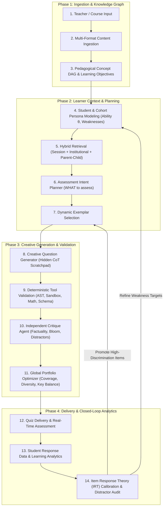

# Master System Architecture Specification 2026
## End-to-End Persona-Adaptive & Closed-Loop AI Multiple-Choice Question (MCQ) Assessment Engine

---

## 1. System Philosophy & Core Design Principles

This document defines the production architecture for an enterprise-grade academic assessment engine designed to generate professor-quality multiple-choice questions (MCQs), deliver persona-adapted tests to learners, and continuously refine question quality using real-world student response analytics.

```
                  THE 3-LAYER ARCHITECTURAL PARADIGM

 ┌─────────────────────────────────────────────────────────────────────────┐
 │ Layer 1: DETERMINISTIC SYSTEM BOUNDARY                                  │
 │ • Concept Prerequisite Topology & DAG Extraction                        │
 │ • Structural Parent-Child RAG Retrieval & Citation Bounding            │
 │ • Code AST Compilation, Sandbox Execution, Math Formula Parsing        │
 │ • Portfolio-Level Constraints (Answer Key Balance, Stem Signature Audit)│
 ├─────────────────────────────────────────────────────────────────────────┤
 │ Layer 2: CREATIVE LLM GENERATION BOUNDARY                              │
 │ • Authentic Narrative Scenario & Contextual Storytelling                │
 │ • Misconception-Driven Distractor Phrasing & Plausible Reasoning        │
 │ • Dynamic Phrasing Variety & Natural Academic Tone                     │
 ├─────────────────────────────────────────────────────────────────────────┤
 │ Layer 3: CLOSED-LOOP ANALYTICS & ITEM CALIBRATION                       │
 │ • Student Ability & Misconception Persona Modeling (IRT)                │
 │ • Empirical Item Difficulty (b_i) & Discrimination (a_i) Calibration   │
 │ • Distractor Efficiency Analysis & Automated Gold Exemplar Promotion   │
 └─────────────────────────────────────────────────────────────────────────┘
```

---

## 2. End-to-End Architectural Pipeline



---

## 3. Detailed Breakdown of Pipeline Stages

### Stage 1: Multi-Format Content Ingestion
* **Inputs**: PDFs, DOCX, PPTX, OCR Handwritten Scans, Audio Transcripts, Raw Prompts.
* **Processing**: Multi-modal parsing, binary ASCII fallback for scanned PDFs, noise filtering (strips administrative syllabus text, zoom links, grading policies).

### Stage 2: Pedagogical Concept Graph & Learning Objectives
* **Prerequisite DAG Construction**: Builds a Directed Acyclic Graph ($V, E$) representing concept dependencies ($A \rightarrow B \rightarrow C$).
* **Pedagogical Centrality Weighting**: Ranks core concepts using prerequisite depth and curriculum importance rather than simple word frequency.

### Stage 3: Student & Cohort Persona Modeling *(New Core Addition)*
Adapts the assessment payload to the target learner cohort:
* **Learner Profile Vector**:
  * **Educational Level**: e.g., 1st-Year Introductory vs. 3rd-Year Core vs. Postgraduate.
  * **Student Ability Parameter ($\theta_s$)**: Estimated latent ability from historical attempts.
  * **Target Weakness Area**: Specific concept gaps (e.g. *"Weak in TCP timeout mechanisms"*).
  * **Misconception Target**: Known cognitive confusions (e.g. *"Confusing ACK loss with frame loss"*).

### Stage 4: Hybrid RAG (Session + Institutional + Parent-Child)
* **Parent-Child Retrieval**: Retrieves small 200-character chunks for exact vector matching, but passes the entire 2,000-word parent section to the LLM to supply rich narrative context.
* **Institutional KB**: Ingests department standards, style guides, and common exam formats.

### Stage 5: Assessment Intent Planner (The "WHAT" Planner)
Generates a lightweight **Assessment Intent Brief** for each question slot. It strictly defines *WHAT* to test without constraining *HOW* to write:

```json
{
  "slot_id": "slot_004",
  "concept": "Sliding Window Protocol",
  "target_bloom": "ANALYZE",
  "target_difficulty": "HARD",
  "student_profile": "3rd Year Computer Science",
  "target_misconception": "Confusing ACK loss timeout with sliding frame corruption",
  "learning_objective": "Evaluate protocol behavior under non-deterministic RTT spikes",
  "evidence_bounds": "In Sliding Window, when an ACK is delayed beyond estimated RTT..."
}
```

### Stage 6: Dynamic Exemplar Selection
* Retrieves 2 gold-standard MCQs from the **Calibrated Exemplar Library** matching the domain (e.g. CS vs Medical vs Finance) to act as in-context demonstrations for style and structure.

### Stage 7: Creative Question Generator (Hidden CoT Scratchpad)
* **Execution Strategy**:
  1. Writes `<reasoning_scratchpad>` (deconstructs concept, builds realistic scenario, designs plausible misconception distractors).
  2. Emits raw JSON containing `stem`, `options`, `correctAnswer`, and `explanation`.
* **Freedom Level**: **MAXIMUM LINGUISTIC FREEDOM** (no arbitrary sentence length rules or forbidden word lists).

### Stage 8: Deterministic Multi-Tool Validation
* **AST & Code Sandbox**: Runs code snippets in an isolated runtime environment to verify zero syntax errors and valid execution output.
* **LaTeX / Math Parser**: Verifies mathematical equation syntax via SymPy.
* **Schema Guard**: Validates JSON structure.

### Stage 9: Independent Critique Agent
* Evaluates factual alignment against `evidence_bounds` and verifies distractor plausibility.
* If an item fails, it returns a targeted critique to Stage 7 for single-item repair (max 1 retry).

### Stage 10: Global Portfolio Optimizer
* **Answer Key Balancer**: Distributes correct options evenly ($25\% \pm 5\%$ across A, B, C, D).
* **Stem Signature Audit**: Limits identical 3-word stem opening signatures to $\le 20\%$ of the quiz portfolio.
* **Difficulty Ramp Sorter**: Orders items progressively (Easy $\rightarrow$ Medium $\rightarrow$ Hard).

### Stage 11: Quiz Delivery & Real-Time Student Analytics
* Delivers live host/student assessments via Socket.io with per-question timers, LaTeX formula rendering, and syntax highlighting.

### Stage 12: Closed-Loop Analytics & Item Calibration *(New Core Addition)*
Closes the loop by evaluating real student response telemetry to continuously upgrade the system.

---

## 4. Mathematical Foundations of Item Calibration & Student Modeling

### 4.1 Item Response Theory (2-Parameter Logistic IRT Model)
The probability $P_i(\theta)$ that a student with latent ability $\theta$ correctly answers question $i$ is modeled as:

$$P_i(\theta) = \frac{1}{1 + e^{-a_i (\theta - b_i)}}$$

Where:
* $\theta$ = Student Latent Ability parameter ($-\infty < \theta < +\infty$).
* $b_i$ = Empirical Item Difficulty parameter (the ability level where $P_i(\theta) = 0.50$).
* $a_i$ = Item Discrimination parameter (sloping steepness of the Item Characteristic Curve).

```
                      ITEM CHARACTERISTIC CURVE (ICC)

         Probability P(θ)
             1.0 │                     / High Discrimination (a_i = 2.0)
                 │                    /
             0.8 │                   /
                 │                  /
             0.5 │─────────────────/─── (b_i = 0.5: Item Difficulty)
                 │                /
             0.2 │               /
                 │              /
             0.0 └───┴───┴───┴───┴───┴───┴───┴───
                    -3  -2  -1   0   1   2   3
                          Student Ability (θ)
```

### 4.2 Distractor Efficiency Index ($DE$)
For an option $j$ in question $i$, Distractor Efficiency measures if wrong choices effectively attract students with lower domain mastery ($\theta < \bar{\theta}$):

$$DE_j = \frac{N_{\text{incorrect\_selected}}(\text{Low Cohort})}{N_{\text{total\_selected}}}$$

* **Non-Functional Distractor**: An option selected by $< 5\%$ of students overall. Non-functional distractors are flagged for automated rewrite by the Critique Agent.
* **Gold Exemplar Promotion**: Questions with high discrimination ($a_i \ge 1.5$) and $100\%$ functional distractors are automatically promoted to the **Gold Exemplar Library**.

---

## 5. Model Allocation & Infrastructure Topology

| Stage / Component | Engine Type | Target Latency | Model / Tool Selection |
| :--- | :--- | :--- | :--- |
| **Ingestion & OCR** | Deterministic + Vision | $< 500\text{ms}$ | `pdf-parse`, `tesseract`, `llama-3.2-vision` |
| **Concept Graph DAG** | Deterministic + Fast LLM | $< 200\text{ms}$ | Custom DAG Builder + `Claude-3.5-Haiku` / `Llama-3.3-70B` |
| **Student Persona & Planner** | High-Reasoning LLM | $< 800\text{ms}$ | `OpenAI o3-mini` / `Claude 3.5 Sonnet` |
| **Exemplar Retriever** | Dense Vector Search | $< 20\text{ms}$ | `pgvector` / `qdrant` (Cosine Distance) |
| **Question Generator** | High-Reasoning LLM | $< 1500\text{ms}$ | `Claude 3.5 Sonnet` / `DeepSeek-R1` (CoT Enabled) |
| **Tool Validation** | Deterministic Engine | $< 50\text{ms}$ | Node.js VM Sandbox, SymPy, AST Parser |
| **Item Calibration (IRT)** | Statistical Engine | Async Background | Python `scikit-irt` / `PyMC3` MCMC Estimation |
