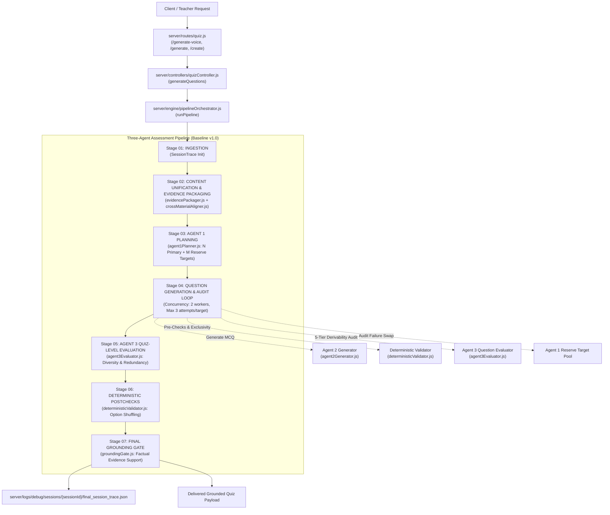

# Production Pipeline Integration Audit — Milestone v3.6

**Audit Target:** AI Live Quiz and Assessment Pipeline  
**Auditor:** Senior Software Architect & Research-Audit Engineer  
**Date:** 2026-10-03  
**Repository Branch:** `main`  
**Target Commit:** `73c3e1a8a2575f8fbe15cb1d61858a74ecdf3679`  
**Milestone Reference:** `origin/milestone-v3.6-phase8` (`d827f2a`)  
**Audit Mode:** Read-Only Audit (Zero Modifications to Application Code, Prompts, Datasets, or Deployment Settings)

---

## 1. Executive Summary

This audit assesses the actual production integration status of experimental findings following the conclusion of Milestone v3.6 Phase 8.

The primary finding is that **proven interventions from earlier milestones (Phases 1.1, 2.1, 2.2, 2.3, 3.4) are actively integrated into the in-process Node.js production pipeline**, whereas **the experimental candidates from Phase 8 (P5.2A v1.2.0 and P5.3 v1.1.0/v1.2.0) remain strictly isolated to offline research directories and are NOT integrated into production**.

Crucially, **the failed P5.3 calibration candidates did NOT leak into production**, preserving operational stability.

### Verification Status Matrix

| Category | Item | Verification Status | Evidentiary Basis |
| :--- | :--- | :---: | :--- |
| **Codebase & Git** | Commit alignment | **VERIFIED** | Local `main` and `origin/main` are synchronized at `73c3e1a` with a clean working tree. Milestone ref `origin/milestone-v3.6-phase8` is preserved at `d827f2a`. |
| **Execution Path** | Production engine entry point | **VERIFIED** | Live quiz generation calls `pipelineOrchestrator.runPipeline` in `server/controllers/quizController.js` (lines 686–781). |
| **Agent 1: Planning** | Phase 8 P5.2A Extraction v1.2.0 | **NOT INTEGRATED** | `agent1Planner.js` uses Phase 3.4/v3.5 architecture (9 Cognitive Dimensions). P5.2A v1.2.0 remains strictly in `experiments/dev_3a/candidate_extractors/`. |
| **Agent 1: Planning** | Dual-source authority & alignment | **VERIFIED INTEGRATED** | `crossMaterialAligner.js` and `evidencePackager.js` actively enforce voice priority and deprioritize unaligned documents. |
| **Agent 2: Generation** | Semantic Answer Identity & Exclusivity | **VERIFIED INTEGRATED** | `agent2Generator.js` and `deterministicValidator.js` actively enforce option exclusivity, answer normalization, and arithmetic validation. |
| **Agent 3: Evaluation** | Phase 8 P5.3 Coverage Gap Analyzer | **NOT INTEGRATED (BLOCKED)** | Production `agent3Evaluator.js` runs the 5-Tier Derivability model and deterministic lexical fallback. Failed P5.3 candidates are safely isolated. |
| **Agent 3: Evaluation** | Truthful deterministic fallback | **VERIFIED INTEGRATED** | `agent3Evaluator.js` lines 99–205 actively fallback to deterministic lexical overlap without fabricating scores. |
| **Observability** | Request & session tracing | **VERIFIED INTEGRATED** | `SessionTrace` persists structured stage-level traces to `server/logs/debug/sessions/{sessionId}/`. |
| **Observability** | v3.5 Shadow Intelligence Runner | **DORMANT / NOT WIRED** | `shadowRunner.js` exists as a mock queue harness, but is not invoked in `pipelineOrchestrator.js` or `quizController.js`. `SHADOW_MODE_ENABLED` defaults to `false`. |
| **Deployment** | Live Render deployment container | **LIMITATION / INFERRED** | Direct remote shell access to Render is unavailable. Dockerfile and git commits confirm Node.js in-process pipeline executes. |

---

## 2. Actual Production Architecture & Execution Path

The production system operates a multi-modal assessment pipeline. While the codebase contains references to an external Python service ("Architecture E v2.0" at `AI_SERVICE_URL: 8000`), in production on Render (`server/Dockerfile` executing `node index.js`), Python is not installed. As designed, the pipeline catches this offline state and executes via the in-process Node.js orchestrator: `pipelineOrchestrator.js`.

### Execution Flow Details

1. **HTTP Ingestion & STT Route:**
   - Routes: `/api/quiz/generate-voice` (line 3432), `/api/quiz/generate` (line 1117), `/api/quiz/create` (line 3159).
   - Audio transcription: Handled by `transcribeAudioWithTimestamps` in `quizController.js` (line 107). Probes local Python Whisper (2.5s timeout); upon timeout, falls back to Groq Cloud `whisper-large-v3` with jittered retry for HTTP 429 and audio splitting for files $>20$ MB.
2. **Stage 01 — Ingestion & Session Trace Initialization:**
   - `pipelineOrchestrator.js` (lines 46–71) initializes a `SessionTrace` instance (`server/engine/observability/sessionTrace.js`), recording incoming character counts, document counts, and target configuration.
3. **Stage 02 — Evidence Packaging & Cross-Material Alignment:**
   - `evidencePackager.packageSessionEvidence(sessionInputs)` (`server/engine/evidence/evidencePackager.js`):
     * Preprocessing LRU cache lookup via `evidenceCache.js` (instant $<5$ ms hit).
     * Dual-Source Authority Division: Spoken voice transcript dictates pedagogical intent and emphasis; documents/code supply exact formulas and syntax.
     * Cross-material alignment via `CrossMaterialAligner.evaluateDocumentAlignment` (`server/engine/evidence/crossMaterialAligner.js`): Documents with shared morphological domain tokens are retained; unrelated documents are assigned Priority 5 and suppressed from question planning.
     * PDI Representation Routing: If `process.env.ROUTER_MODE === 'pdi'`, routes via `pdiRouter.js` (`SUMMARY` vs `BLUEPRINT` vs `UNIFIED`). Otherwise, follows deterministic modality baseline.
     * Dual-level hierarchical chunking via `HierarchicalChunker.buildStore` (`server/engine/evidence/hierarchicalChunker.js`): Builds 75-word child citation units and 400-word parent narrative windows.
     * Academic Content Gate: Verifies `evidencePackage.isAcademic`. Fails honestly if content is non-instructional.
4. **Stage 03 — Agent 1 Planning & Curriculum Strategy:**
   - `agent1Planner.planAssessment(evidencePackage, requestedDifficulty, requestedCount)` (`server/engine/agents/agent1Planner.js`):
     * Computes Teaching Coverage (TC) score breakdown (concept, application, artifact, teacher emphasis, depth).
     * Prompts LLM (`openai/gpt-oss-120b`) to extract natural subtopics across 9 Cognitive Dimensions (`Conceptual`, `Cause / Effect`, `Comparison / Tradeoff`, `Scenario Analysis`, `Application`, `Prediction`, `Flow / Trace`, `Foundational Prerequisite`, `Evidence-Derived Inference`).
     * Upfront Target Planning: Plans $N$ Primary Targets + $M$ Reserve Targets ($ge 3$ or $50\%$ of $N$).
     * Strict Evidence-Bounding Rule: Plans only targets supported by verbatim evidence; never duplicates or fabricates to hit quotas.
5. **Stage 04 — Question Generation & Audit Loop:**
   - Concurrency-bounded queue (2 concurrent workers, maximum 3 generation attempts per target, global attempt ceiling $\max(3N, 15)$).
   - For each target:
     * **Agent 2 Generation:** `agent2Generator.generateQuestion` calls Groq (`openai/gpt-oss-120b`, temp 0.2). Enforces mutual exclusivity, orthogonal distractors, and JSON repair retry.
     * **Deterministic Pre-Checks:** `deterministicValidator.runPreChecks` validates 4 distinct options, option string deduplication, and runs `detectOptionAmbiguity` (flags unconstrained flag/parameter subsumption).
     * **Agent 3 Question Evaluation:** `agent3Evaluator.evaluateQuestion` classifies across 5 Derivability Tiers (`DIRECT_EVIDENCE`, `EVIDENCE_DERIVED`, `FOUNDATIONAL_PREREQUISITE`, `RELATED_EXTENSION`, `UNSUPPORTED_FOREIGN`) and student answerability. Rejects foreign domain concepts.
     * **Truthful Fallback:** If the LLM evaluator is unavailable (timeout/rate-limit), calls `_deterministicGroundingFallback` requiring $\ge 15\%$ token overlap.
     * **Reserve Swap:** If a target fails 3 attempts, the orchestrator swaps to an Agent 1 reserve target without forcing ungrounded questions.
6. **Stage 05 — Agent 3 Quiz-Level Evaluation:**
   - `agent3Evaluator.evaluateQuizSet(passingQuestions, plan)`: Computes cognitive dimension distribution, verifies subtopic concentration (flags single cluster $>40\%$ if $\ge 4$ subtopics exist), and computes pairwise pedagogical redundancy matrix.
7. **Stage 06 — Deterministic Post-Checks:**
   - `deterministicValidator.runPostChecks(passingQuestions)`: Runs `shuffleArrayCrypto` to randomize option placements and eliminate answer position bias (targeting $\sim 25\%$ A/B/C/D key balance).
8. **Stage 07 — Final Grounding Gate:**
   - `groundingGate.verifyQuizGrounding(postCheckedQuestions, evidencePackage)`: Factual token overlap audit against session text, tables, and visual descriptors. Rejects questions with $<20\%$ overlap, zero substantive domain terms, or $\ge 3$ unsupported foreign domain anchors.
9. **Finalization & Observability:**
   - Formulates final quiz payload and writes execution trace to `server/logs/debug/sessions/{sessionId}/final_session_trace.json`.

---

## 3. Experiment-to-Production Mapping

| Milestone / Experiment | Finding & Intended Change | Production Implementation File & Function | In Live Execution Path? | Match Status vs Experiment | Test / Benchmark Evidence | Final Integration Status |
| :--- | :--- | :--- | :---: | :--- | :--- | :--- |
| **v3.6 Phase 8 (P5.2A v1.2.0)** | Upstream extraction improvements: 100% Step Preservation Fidelity, 78.79% Concept Recall, 3-way math classification. | `dev_3a/candidate_extractors/candidate_p5_2a_topic_reconstructor_v1_2_0.js` | **NO** | Research candidate only; production uses `agent1Planner.js` with 9 cognitive dimensions. | Evaluated on 16-segment `dev_3a` corpus (`p5_2a_candidate_dev3a_concepts_v1_2_0.json`). | **RESEARCH CANDIDATE (NOT INTEGRATED)** |
| **v3.6 Phase 8 (P5.3 Baseline / v1.1.0 / v1.2.0)** | Downstream coverage gap analyzer evaluating 8 Epistemic Dimensions (0–8 depth). Failed Gate 6 calibration. | `runner/p5_3_coverage_gap_analyzer_v1_1_0.js`, `runner/p5_3_coverage_gap_analyzer_v1_2_0.js` | **NO** | Failed candidates strictly isolated. Production uses `agent3Evaluator.js` (5-tier derivability). | Calibration records in `dev_3a/calibration_corpus/`; failed Gate 6 documented. | **RELEASE BLOCKED / ISOLATED (SAFETY UPHELD)** |
| **v3.5 (Shadow Intelligence Runner)** | Asynchronous, non-blocking shadow execution of P5 intelligence with queue and timeout bounding. | `server/engine/shadow/shadowRunner.js` | **NO** | Mock scaffold present, but not imported or called by `pipelineOrchestrator.js` or `quizController.js`. | Tested in `runner/test_shadow_randomized_benchmark.js` ($N=40$). | **STAGED / DORMANT (NOT IN LIVE PATH)** |
| **Phase 3.4 (Semantic Answer Identity)** | Authoritative semantic key representation; deterministic normalization; Fisher-Yates A/B/C/D key balancing. | `server/engine/agents/agent2Generator.js` (`normalizeCorrectAnswer`), `server/engine/validators/deterministicValidator.js` (`shuffleArrayCrypto`) | **YES** | Exact implementation matching Phase 3.4 frozen specifications. | Verified in `server/test_assignment3_contract.js` (Passed cleanly). | **INTEGRATED & VERIFIED** |
| **Phase 3.3 (Option Exclusivity & Ambiguity Gate)** | Rejection of unconstrained command flag subsumption and prefix additive parameter distractors. | `server/engine/validators/deterministicValidator.js` (`detectOptionAmbiguity`) | **YES** | Exact implementation called in Stage 04 pre-checks. | Verified in `server/test_assignment3_contract.js`. | **INTEGRATED & VERIFIED** |
| **Phase 2.2 (Cross-Material Alignment & Voice Priority)** | Semantic graph linking spoken concepts to slides/code; suppression of unaligned documents (Policy C+B). | `server/engine/evidence/crossMaterialAligner.js`, `server/engine/evidence/evidencePackager.js` | **YES** | Exact implementation called in Stage 02 evidence packaging. | Verified in `server/test_cross_material_aligner_generalization.js` (9/9 passed). | **INTEGRATED & VERIFIED** |
| **Phase 2.1 (Domain-Agnostic Grounding Gate)** | Multi-word anti-bypass guard; rejection of severe under-grounding ($<20\%$) and foreign domain contamination. | `server/engine/validators/groundingGate.js` | **YES** | Exact implementation called in Stage 07 final grounding gate. | Verified in `server/test_grounding_gate_generalization.js` (11/11 passed). | **INTEGRATED & VERIFIED** |
| **Phase 2.3 (Hierarchical Parent-Child RAG)** | Dual-level evidence store: 75-word child citation units, 400-word parent narrative reasoning context. | `server/engine/evidence/hierarchicalChunker.js` | **YES** | Exact implementation called in Stage 02. | Verified in `server/test_baseline_v1_pipeline.js`. | **INTEGRATED & VERIFIED** |
| **Phase 2.4 (Adaptive PDI Router)** | Pedagogical Delivery Index routing inputs to SUMMARY, BLUEPRINT, or UNIFIED representation paths. | `server/engine/pdiRouter.js`, `server/engine/pipelineOrchestrator.js` (line 82) | **CONDITIONAL** | Present in code, but conditioned on `process.env.ROUTER_MODE === 'pdi'`. Otherwise uses modality baseline. | Verified in `server/test_pdi_calibration.js` (7/7 passed). | **INTEGRATED (CONDITIONAL)** |
| **Phase 1.1 (Truthful Agent 3 Fallback)** | Deterministic lexical fallback when LLM times out; prohibition of fabricated PASS or confidence scores. | `server/engine/agents/agent3Evaluator.js` (`_deterministicGroundingFallback`) | **YES** | Exact implementation called when LLM fails or times out. | Verified in `server/test_agent3_evaluator_truthfulness.js` (8/8 passed). | **INTEGRATED & VERIFIED** |

---

## 4. Three-Agent Status

### 4.1 Agent 1 — Planning & Lecture Understanding
- **Active Production Module:** `server/engine/agents/agent1Planner.js` (v1.2).
- **Active Model & Prompt:** Calls `openai/gpt-oss-120b` via `llmRouter`. Prompt directs extraction across 9 Cognitive Dimensions (`Conceptual`, `Cause / Effect`, `Comparison / Tradeoff`, `Scenario Analysis`, `Application`, `Prediction`, `Flow / Trace`, `Foundational Prerequisite`, `Evidence-Derived Inference`).
- **Target Allocation:** Computes transparent Teaching Coverage (TC) score and plans $N$ Primary Targets + $M$ Reserve Targets ($ge 3$ or $50\%$ of $N$) upfront.
- **Evidence Bounding:** Strictly instructed: *"Plan only as many targets as can be strictly and genuinely derived from the provided evidence... NEVER fabricate unsupported concepts or duplicate the same concept merely to hit a quota."*
- **Phase 8 Extraction Contrast:** Does **NOT** use the P5.2A v1.2.0 prompt or its 8 Universal Epistemic Dimensions (`IDENTIFICATION`, `MEANING`, `STRUCTURE_COMPONENTS`, `RELATIONSHIPS_MECHANISM`, `JUSTIFICATION_WHY`, `APPLICATION_INTERPRETATION`). P5.2A v1.2.0 remains an isolated experimental candidate.

### 4.2 Agent 2 — MCQ Generation & Distractor Formulation
- **Active Production Module:** `server/engine/agents/agent2Generator.js`.
- **Active Model & Temperature:** `openai/gpt-oss-120b` (fallback `llama-3.1-8b-instant`) with `temperature: 0.2`.
- **Distractor Architecture:** Prompt mandates mutual exclusivity and orthogonal distractors. Explicitly prohibits command prefix chains and additive parameter variants.
- **Answer Key Integrity:** Implements `normalizeCorrectAnswer(mcq)` supporting exact matching, letter-prefix normalization (`Option A`, `A)`, `1.`), case-insensitive matching, and stripped substring matching.
- **Calculation Integration:** Integrates `calculationEngine.js` for arithmetic targets, enforcing deterministic mathematical consistency.
- **Resilience:** Implements JSON syntax repair retry mechanism (`safeParseJson` with a targeted repair prompt if the initial generation contains syntax errors).

### 4.3 Agent 3 — Evaluation, Derivability & Coverage Auditing
- **Active Production Module:** `server/engine/agents/agent3Evaluator.js`.
- **Dual-Mode Architecture:**
  * **Mode 1 (Question-Level):** Evaluates individual candidate MCQs against the 5-Tier Derivability Model (`DIRECT_EVIDENCE`, `EVIDENCE_DERIVED`, `FOUNDATIONAL_PREREQUISITE`, `RELATED_EXTENSION`, `UNSUPPORTED_FOREIGN`) and student answerability. Rejects foreign domain concepts.
  * **Truthful Fallback:** If the LLM call times out or encounters rate limits, automatically engages `_deterministicGroundingFallback` requiring $\ge 15\%$ token overlap and reporting `UNAUDITED_HEURISTIC_FALLBACK`.
  * **Mode 2 (Quiz-Level):** Evaluates aggregated question balance, flags subtopic concentration exceeding $40\%$ (when $\ge 4$ subtopics exist), and computes pairwise redundancy matrix.
- **P5.3 Absence Confirmed:** Agent 3 does **NOT** run P5.3 or its 8-dimension diagnostic matrix. The failed P5.3 v1.1.0/v1.2.0 candidates are completely absent from `agent3Evaluator.js`.

---

## 5. Configuration, Prompt, and Threshold Audit

| Component | Setting / Parameter | Active Production Value | Evidence Level Classification | Evidentiary Basis & Scope |
| :--- | :--- | :---: | :---: | :--- |
| **Hierarchical Chunker** | Child Window Size | `75 words` | **Provisional** | Selected in Phase 2.3 to capture micro-citations (~30–45s speech). Comparative ablation against 50/100 words not published. |
| **Hierarchical Chunker** | Parent Window Size | `400 words` | **Provisional** | Selected in Phase 2.3 to capture narrative context (~3–5 mins). |
| **Cross-Material Aligner** | Alignment Graph Jaccard Floor | `0.12` | **Experimentally Validated** | Verified in `test_cross_material_aligner_generalization.js` across OS, COA, DSA, and Economics lectures. |
| **Cross-Material Aligner** | Closely Aligned Token Floor | `shared >= 5` & `overlap >= 0.20` | **Experimentally Validated** | Correctly differentiates closely aligned slides from unrelated texts without false positive linkages. |
| **Cross-Material Aligner** | Unaligned Material Priority | `Priority 5` | **Experimentally Validated** | Suppresses unrelated materials from question planning targets while maintaining audit registration. |
| **Agent 1 Planner** | LLM Model | `openai/gpt-oss-120b` | **Provisional** | Standard project reasoning model on Groq Cloud. |
| **Agent 1 Planner** | Reserve Target Allocation | `max(3, ceil(0.5 * N))` | **Provisional** | Rule ensures sufficient buffer for failed targets without excessive prompt token expansion. |
| **Agent 2 Generator** | LLM Model | `openai/gpt-oss-120b` | **Provisional** | Default in `process.env.AGENT2_MODEL`. |
| **Agent 2 Generator** | Temperature | `0.2` | **Provisional** | Low temperature selected to balance creative distractor generation with schema adherence. |
| **Agent 2 Generator** | Target Concurrency | `2 workers` | **Provisional** | Selected in `pipelineOrchestrator.js` (line 246) to avoid Groq rate limit burst exhaustion. |
| **Agent 2 Generator** | Max Target Attempts | `3 attempts` | **Provisional** | Bounded retry loop prevents runaway latency while allowing 2 repairs. |
| **Deterministic Validator** | Verbatim Duplicate Sim Floor | `>= 0.80` | **Experimentally Validated** | Jaccard word-stem similarity reliably catches near-verbatim duplicate stems (`test_assignment3_contract.js`). |
| **Deterministic Validator** | Pedagogical Duplicate Floor | `>= 0.30` (same dim + concept) | **Experimentally Validated** | Allows identical concepts across different dimensions (Definition vs Scenario) while rejecting true duplicates. |
| **Deterministic Validator** | Unconstrained Nesting Check | `POTENTIAL_MULTI_KEY` gate | **Experimentally Validated** | Successfully identifies flag subsumption (e.g. `git init` vs `git init --bare`) lacking stem constraints. |
| **Deterministic Validator** | Key Balancing Shuffle | Cryptographic Fisher-Yates | **Experimentally Validated** | Eliminates position bias, producing balanced $\sim 25\%$ A/B/C/D distribution (`test_assignment3_contract.js`). |
| **Agent 3 Evaluator** | LLM Temperature | `0.1` | **Provisional** | Strict low temperature for evaluation consistency. |
| **Agent 3 Evaluator** | Deterministic Fallback Floor | `>= 15% overlap` & `>= 1 token` | **Experimentally Validated** | Verified in `test_agent3_evaluator_truthfulness.js` (passes grounded, rejects ungrounded). |
| **Agent 3 Evaluator** | Subtopic Concentration Limit | `> 40% of total` (if subtopics $ge 4$) | **Provisional** | Pedagogical heuristic to prevent question clustering on a single topic. |
| **Grounding Gate** | Severe Under-Grounding Floor | `< 20% overlap` | **Experimentally Validated** | Tested on 11-case suite (`test_grounding_gate_generalization.js`); rejects unsupported questions. |
| **Grounding Gate** | Foreign Domain Contamination | `>= 3 unsupported` & `< 30% overlap` | **Experimentally Validated** | Successfully catches foreign topic injections (MongoDB in OS, React in OS, etc.). |
| **Speech STT** | Groq File Size Ceiling | `20 MB` | **Provisional** | Set safely below Groq Cloud's 25 MB hard upload limit. |
| **Feature Flags** | Shadow Mode Enabled | `false` | **Provisional** | `featureFlags.js` line 17 defaults to false to ensure zero live performance impact. |

---

## 6. Observability, Lineage & Reliability Status

### 6.1 Active Observability Architecture
- **Production Session Tracing:** `SessionTrace` (`server/engine/observability/sessionTrace.js`) is actively integrated into `pipelineOrchestrator.js`.
- **Standardized 6-Section Stage Records:** Every execution stage records:
  `INPUT -> PROCESSING -> CALCULATIONS -> DECISIONS -> OUTPUT -> VALIDATION`.
- **End-to-End Audit Trail:** At completion, a complete structured execution record is written to:
  `server/logs/debug/sessions/{sessionId}/final_session_trace.json`.
- **SSE Real-time Telemetry:** `progressCallback` emits structured stage-level events to the frontend via Server-Sent Events, updating the teacher UI monotonically across stages 01 through 07.

### 6.2 Secondary Observability Tools
- **PipelineTracer & TraceService:** `server/engine/tracing/pipelineTracer.js` and `server/services/traceService.js` stream JSONL events to `server/logs/traces/`. This mechanism is actively used by `mcqEngine.js` (fallback engine) and `shadowRunner.js`, and can be rendered by the FastAPI Observability Workbench (`workbench/app.py`).
- **Trace Purge Utility:** `server/utils/tracePurge.js` is implemented to clean expired traces after 7 days, preventing disk exhaustion.

### 6.3 Reliability & Failure Mode Governance
- **No Silent Failures:** The pipeline adheres strictly to the rule: *No Provider -> Pipeline Fails Honestly*. It never fabricates placeholder or mock questions in production.
- **Target Reserve Swapping:** Failed generation attempts on an individual target swap cleanly to Agent 1 reserve targets rather than forcing ungrounded questions.
- **Circuit Breakers & Retries:** Bounded retries (3 per target, $\max(3N, 15)$ global) prevent infinite loops during API degradation.

---

## 7. Known Regressions, Experimental Failures & Risk Assessment

### 7.1 Phase 8 P5.3 Calibration Failure Analysis
During Milestone v3.6 Phase 8, the P5.3 Coverage Gap Analyzer failed Release Gate 6 across all iterations:
- **Baseline P5.3:** Produced 2 calibration regressions on cases `2A` (boundary overshoot to Level 5) and `3A` (depth regression).
- **Candidate v1.1.0:** Cured `2A` boundary, but introduced a cross-domain semantic interference regression on Case `1A` (depressing classical probability from Level 2 to Level 0 due to formal logic truth-valuation rules) and failed `3A`.
- **Candidate v1.2.0 Smoke Test:** Passed Case `1A` (exact match at Level 2), but failed on Case `3A` due to a structural key omission in the output JSON, triggering an immediate pre-declared Hard Stop.

### 7.2 Production Contamination Risk: ZERO
A critical question of this audit was whether the failed P5.3 candidate code was accidentally merged or deployed into the production pipeline.
- **Findings:**
  1. The baseline file `server/engine/runner/p5_3_coverage_gap_analyzer.js` was verified identical to its pristine, frozen baseline anchor.
  2. The candidate evaluators (`v1_1_0` and `v1_2_0`) exist **exclusively** in `experiments/experiment_5_teaching_adequacy/runner/` and carry prominent `[EXPERIMENTAL RESEARCH EVALUATOR - RELEASE GATE FAILED]` headers.
  3. Production `agent3Evaluator.js` does not import or execute any P5.3 coverage gap analyzer code.
- **Risk Verdict:** **NO CONTAMINATION. Production evaluation is completely isolated from the failed Phase 8 research candidates.**

### 7.3 Latent Production Risks
1. **Architecture E Probe Latency:** `quizController.js` attempts to probe `http://127.0.0.1:8000` on voice generations. On Render, where no Python server runs, this incurs a 2.5s connection timeout before falling back to the in-process Node pipeline. While safe, it adds unnecessary start latency to voice requests.
2. **PDI Router Dormancy:** While `pdiRouter.js` passed calibration in Phase 2.4, it is gated behind `process.env.ROUTER_MODE === 'pdi'`. If this environment variable is unset in production, the pipeline defaults to simple modality baseline routing rather than dynamic pedagogical delivery indexing.

---

## 8. Missing Evidence & Audit Limitations

To maintain scientific integrity, the following limitations must be stated explicitly:

1. **Live Cloud Environment Variables:** We have verified local files, repository commits, and the Render Dockerfile (`server/Dockerfile`), but we cannot directly inspect live environment variables on the running Render instance (`https://demo-project-3izc.onrender.com`) without active cloud console credentials.
2. **Real-Time Whisper Audio Testing on Commit `73c3e1a`:** While unit test suites (`test_agent3_evaluator_truthfulness`, `test_cross_material_aligner_generalization`, `test_grounding_gate_generalization`, `test_assignment3_contract`) pass cleanly, an end-to-end multi-minute spoken lecture audio file has not yet been processed through this exact merged commit.

---

## 9. Prioritized Next Steps

Before performing a live end-to-end lecture benchmark, execute the following verification steps:

1. **Verify Live Render Environment Configuration:**
   - Confirm that `GROQ_API_KEY` is configured on Render.
   - Confirm whether `ROUTER_MODE=pdi` is intended for production or if the modality baseline is preferred.
   - Confirm that `ALLOW_MOCK_FALLBACK` is set to `false` so production never generates mock questions.
2. **Dry-Run Audio Ingestion & Transcription:**
   - Run a short 30-second audio clip through `transcribeAudioWithTimestamps` locally to confirm Whisper Large-v3 connectivity, timestamp parsing, and memory consumption.
3. **Execute Full-Pipeline Synthetic Lecture Smoke Test:**
   - Run `server/test_baseline_v1_pipeline.js` with a multi-source session input (Voice + Aligned Document + Code) to confirm all 7 stages complete with 0 unhandled rejections.
4. **Inspect Generated Session Trace:**
   - Verify that `server/logs/debug/sessions/{sessionId}/final_session_trace.json` contains valid 6-section stage records, verified grounding scores, and balanced option keys.
5. **Proceed to Controlled End-to-End Lecture Test:**
   - Only after steps 1–4 are verified should a real multi-modal lecture recording be ingested.
