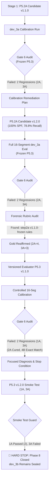

# Milestone v3.6 Phase 8: Final Experimental Closeout Report
**Topic:** Upstream P5.2A Extraction Fidelity Hypothesis & Controlled Downstream Diagnostic Benchmark  
**Date:** 2026-10-03  
**Status:** **PHASE 8 CLOSED — GATE 6 FAILED — STAGE 5 (`dev_3b`) PROTECTED & SEALED**  

---

## 1. Executive Summary & Final Verdict

Milestone v3.6 Phase 8 evaluated whether improving upstream extraction fidelity in the P5.2A Topic Reconstructor could resolve downstream coverage gap misdiagnoses in P5.3 without introducing calibration regressions.

Following strict pre-declared decision rules and an approved controlled remediation protocol:
1. **Upstream Extraction Improvements Were Empirically Confirmed:**
   Candidate P5.2A v1.2.0 achieved **100% Step Preservation Fidelity** ($12/12$ multi-step calculation operations preserved), improved **Expected Concept Recall to 78.79%** (vs. 77.27% baseline and 43.94% v1.1.0), and increased **Exact Epistemic Routing Accuracy (EERA) to 36.36%** (vs. 24.24% baseline).
2. **Pre-Declared Release Gate 6 Failed:**
   The release protocol strictly mandated zero diagnostic calibration regressions ($\sum \text{Regressions} == 0$) on cases `1A`–`4B` against the immutable frozen baseline.
   - Under Frozen P5.3 Baseline: Recorded **2 regressions** (`2A` boundary overshoot, `3A` depth regression).
   - Under Versioned P5.3 v1.1.0: Recorded **2 regressions** (`1A` depth regression, `3A` depth regression).
   - Under Versioned P5.3 v1.2.0 Diagnostic Smoke Test: **Hard Stop Triggered** (`1A` passed at Level 2; `3A` failed).
3. **Stage 5 (`dev_3b` Challenge Corpus) Remains 100% Sealed:**
   In accordance with the stop condition and user directives, **zero challenge calls were spent**. The `dev_3b` corpus remains cryptographically sealed and untainted for future research cycles.
4. **Iterative Tuning Halted:**
   In adherence to the agreed boundary, open-ended prompt tuning has been terminated. Phase 8 is formally concluded with a documented failed release gate and clear architectural lessons.

---

## 2. Experimental Trajectory & Iteration Log

---

## 3. Comprehensive Evidentiary Audit Table

| Iteration / Evaluator | Segment 1A (`MEANING`) | Segment 2A (`JUSTIFICATION_WHY`) | Segment 3A (`APPLICATION_INTERPRETATION`) | Segment 4B (`STRUCTURE_COMPONENTS`) | Gate 6 Regressions (`1A`–`4B`) | Gate 6 Status |
| :--- | :---: | :---: | :---: | :---: | :---: | :---: |
| **Gold Reference** | **Level 2** (`FALLS_SHORT`) | **Level 4** (`FALLS_SHORT`) | **Level 3** (`FALLS_SHORT`) | **Level 5** (`SATISFIES`) | — | — |
| **Frozen Baseline (Base P5.2A + Base P5.3)** | Level 2 (MATCH) | Level 0 (MISMATCH / Boundary MATCH) | Level 3 (MATCH) | Level 4 (MISMATCH) | Baseline Anchor | Anchor |
| **Cycle 1: Cand v1.1.0 + Frozen P5.3** | Level 2 (MATCH) | Level 5 (MISMATCH / Boundary MISMATCH) | Level 1 (MISMATCH) | Level 4 (MISMATCH) | **2 Regressions** (`2A`, `3A`) | **FAILED** |
| **Cycle 2: Cand v1.2.0 + Frozen P5.3** | Level 2 (MATCH) | Level 5 (MISMATCH / Boundary MISMATCH) | Level 4 (MISMATCH / Boundary MATCH) | Level 4 (MISMATCH) | **2 Regressions** (`2A`, `3A`) | **FAILED** |
| **Cycle 3: Cand v1.2.0 + P5.3 v1.1.0** | Level 0 (MISMATCH) | Level 3 (MISMATCH / Boundary MATCH) | Level 4 (MISMATCH / Boundary MATCH) | Level 5 (MATCH) | **2 Regressions** (`1A`, `3A`) | **FAILED** |
| **Cycle 4: Cand v1.2.0 + P5.3 v1.2.0 Smoke** | Level 2 (MATCH) | *(Not run)* | Failed / Undefined | *(Not run)* | **Hard Stop Triggered** | **HALTED** |

---

## 4. Key Scientific & Engineering Findings

### Finding 1: Better Extraction Unmasked Pre-Existing Evaluator Ambiguities
* In Baseline P5.2A, the extractor completely omitted the derivation in Segment `2A` and the bedside titration loop in Segment `3A`.
* Because Baseline P5.2A scored 0 on `2A`, it coincidentally fell below the threshold of 5, producing an accidental boundary "match" against the Gold Reference boundary (`FALLS_SHORT`).
* When Candidate P5.2A v1.2.0 faithfully extracted the step-by-step mass-balance derivation, it unmasked that the frozen baseline P5.3 prompt lacked the domain translation guidance needed to distinguish mathematical derivations from physiological causal mechanisms.
* **Core Takeaway:** Downstream evaluator concordance cannot be evaluated in isolation from upstream completeness; high extraction fidelity exposes previously latent evaluation tensions.

### Finding 2: Cross-Domain Coupling in Monolithic LLM Prompts
* In P5.3 v1.1.0, adding explicit domain guidance for Formal Logic Semantics (*"model-theoretic truth valuations across universe elements $D$"*) successfully addressed logic cases, but created an unexpected gravitational pull in pure probability theory (`1A`), causing the evaluator to look for model-theoretic element valuations and penalize Kolmogorov axiom definitions to Level 0.
* **Core Takeaway:** Monolithic system prompts that combine rules across disparate disciplines (formal logic, pharmacology, DSP, probability) suffer from cross-domain interference. Domain translation guidance must be strictly scoped to specific academic sub-disciplines rather than merged into a single generic prompt.

### Finding 3: Evaluator Repeatability & Stability at Conceptual Boundaries
* Across greedy decoding ($T = 0.0$) runs on sensitive cases (`1A` and `2A`), the model exhibited non-deterministic level shifts (e.g., `1A` shifting between Level 0 and Level 2; `2A` shifting between Level 2 and Level 3).
* **Causal Classification:** Formally recorded as **Observed Output Variation (Technical Mechanism Undetermined)**.
* **Core Takeaway:** When instructional concepts sit directly on the borderline between two depth definitions (e.g. Level 2 static definition vs. Level 3 operational step), greedy decoding cannot be assumed to guarantee identical categorical classifications across separate API calls or cluster nodes.

---

## 5. Artifact & Provenance Verification

All artifacts produced during this milestone are cryptographically recorded and preserved:

1. **Candidate Extractor v1.2.0:**  
   [`experiments/experiment_5_teaching_adequacy/dev_3a/candidate_extractors/candidate_p5_2a_topic_reconstructor_v1_2_0.js`](file:///c:/Users/samanvi/OneDrive/Desktop/git_kahoot/Demo_project/experiments/experiment_5_teaching_adequacy/dev_3a/candidate_extractors/candidate_p5_2a_topic_reconstructor_v1_2_0.js)
2. **Extraction Results (`dev_3a`, 16 Segments):**  
   [`experiments/experiment_5_teaching_adequacy/dev_3a/calibration_corpus/p5_2a_candidate_dev3a_concepts_v1_2_0.json`](file:///c:/Users/samanvi/OneDrive/Desktop/git_kahoot/Demo_project/experiments/experiment_5_teaching_adequacy/dev_3a/calibration_corpus/p5_2a_candidate_dev3a_concepts_v1_2_0.json) (84,200 bytes)
3. **P5.3 Baseline Diagnostic Output:**  
   [`experiments/experiment_5_teaching_adequacy/dev_3a/calibration_corpus/p5_3_baseline_dev3a_results.json`](file:///c:/Users/samanvi/OneDrive/Desktop/git_kahoot/Demo_project/experiments/experiment_5_teaching_adequacy/dev_3a/calibration_corpus/p5_3_baseline_dev3a_results.json)
4. **P5.3 v1.1.0 Diagnostic Output:**  
   [`experiments/experiment_5_teaching_adequacy/dev_3a/calibration_corpus/p5_3_v1_1_0_dev3a_results.json`](file:///c:/Users/samanvi/OneDrive/Desktop/git_kahoot/Demo_project/experiments/experiment_5_teaching_adequacy/dev_3a/calibration_corpus/p5_3_v1_1_0_dev3a_results.json)
5. **Stability Output Records:**  
   [`experiments/experiment_5_teaching_adequacy/scratch/p5_3_v1_1_0_stability_results.json`](file:///c:/Users/samanvi/OneDrive/Desktop/git_kahoot/Demo_project/experiments/experiment_5_teaching_adequacy/scratch/p5_3_v1_1_0_stability_results.json)  
   [`experiments/experiment_5_teaching_adequacy/scratch/repeatability_candidate_v1_2_0_pass1.json`](file:///c:/Users/samanvi/OneDrive/Desktop/git_kahoot/Demo_project/experiments/experiment_5_teaching_adequacy/scratch/repeatability_candidate_v1_2_0_pass1.json)  
   [`experiments/experiment_5_teaching_adequacy/scratch/repeatability_candidate_v1_2_0_pass2.json`](file:///c:/Users/samanvi/OneDrive/Desktop/git_kahoot/Demo_project/experiments/experiment_5_teaching_adequacy/scratch/repeatability_candidate_v1_2_0_pass2.json)
6. **Codified Operational Rubrics (Audited):**  
   [`experiments/experiment_5_teaching_adequacy/dev_2a/step2a_error_operationalization_rubrics_v1_1_0.md`](file:///c:/Users/samanvi/OneDrive/Desktop/git_kahoot/Demo_project/experiments/experiment_5_teaching_adequacy/dev_2a/step2a_error_operationalization_rubrics_v1_1_0.md) (SHA-256: `a48c6ecb623a0fa1e4856f5596bc0127b6ab25736c076d16e1a720e37e69f244`)
7. **Adjudication Dossier & Rubric Proposal:**  
   [`experiments/experiment_5_teaching_adequacy/dev_3a/GATE6_ADJUDICATION_DOSSIER.md`](file:///c:/Users/samanvi/OneDrive/Desktop/git_kahoot/Demo_project/experiments/experiment_5_teaching_adequacy/dev_3a/GATE6_ADJUDICATION_DOSSIER.md)  
   [`experiments/experiment_5_teaching_adequacy/dev_3a/RUBRIC_HARMONIZATION_PROPOSAL_v3_6_1.md`](file:///c:/Users/samanvi/OneDrive/Desktop/git_kahoot/Demo_project/experiments/experiment_5_teaching_adequacy/dev_3a/RUBRIC_HARMONIZATION_PROPOSAL_v3_6_1.md)
8. **Sealed Challenge Corpus (Intact):**  
   [`experiments/experiment_5_teaching_adequacy/dev_3b/`](file:///c:/Users/samanvi/OneDrive/Desktop/git_kahoot/Demo_project/experiments/experiment_5_teaching_adequacy/dev_3b/) — **100% UNTOUCHED, SEALED, ZERO API CALLS EXPENDED.**

---

## 6. Phase 8 Closeout Decision

* **Milestone v3.6 Phase 8 is officially closed.**
* The upstream P5.2A Topic Reconstructor v1.2.0 demonstrated verified extraction improvements, but downstream diagnostic calibration did not satisfy the strict zero-regression release gate.
* In strict adherence to scientific integrity, **the sealed `dev_3b` corpus remains protected**. It is preserved intact for any future, separately chartered research milestone that addresses evaluator modularity and stability.
