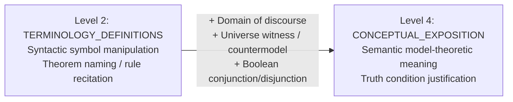
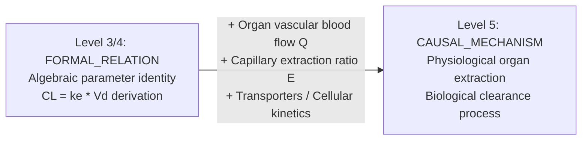
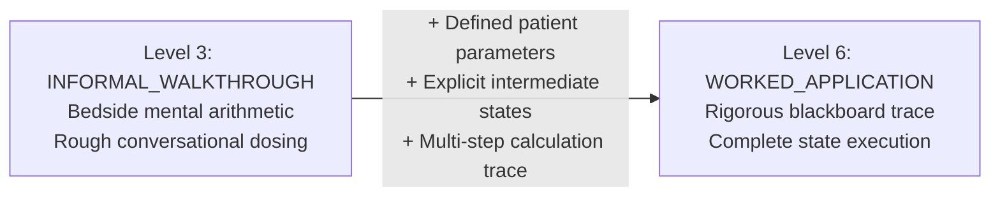
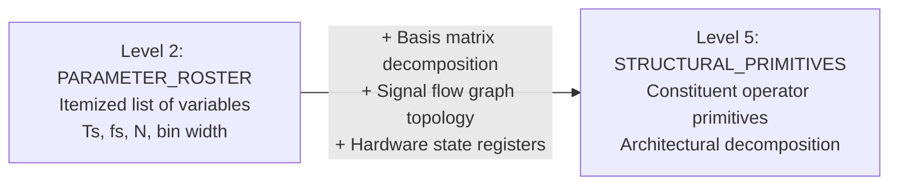

# Milestone v3.6 Step 2A — Phase 2: Error-Analysis Protocols & Operationalized Rubrics

**Document Version:** `1.0.0-frozen`  
**Timestamp:** `2026-10-02T00:50:00Z`  
**Status:** Cryptographically Sealed Prior to Phase 3 Blind Review  
**Milestone:** Milestone v3.6 Step 2A (Diagnostic Investigation)

---

## 1. Governance & Methodological Safeguards

This document formalizes the four operational rubrics governing the diagnostic review and attribution process for Milestone v3.6 Step 2A. In accordance with methodological standards:

1. **Predeclared Targeted Consistency Check:**  
   The Option B corpus (`dev_2a_01`–`dev_2a_04`) partitions each package into Diagnostic Exploration (Segments A & B) and Held-Back Validation (Segments C & D). The 8 validation segments serve as a targeted consistency check on whether a narrowly defined boundary rule holds across analogous cases within the same micro-lecture series; they do **not** constitute broad evidence of cross-domain generalization.
2. **Retrospective Step 1B Boundary:**  
   The original prospective evaluation disagreements (pharmacology clearance mechanism FN, clinical dosing FP, predicate logic quantifier duality FP, and Fourier DSP structure FP) remain retrospective hypotheses grounded strictly in historical Step 1B logs and adjudication records. The `dev_2a` corpus tests whether the hypothesized failure modes recur under controlled experimental conditions; it does not retroactively mutate Step 1B records.
3. **Dual Agreement Reporting Standard:**  
   Inter-annotator agreement in Phase 3 will report exact agreement counts, contingency tables, qualitative disagreement logs, and Cohen's $\kappa$. A score of $\kappa < 0.60$ serves as an **initial review trigger**, prompting qualitative inspection of disagreement records to isolate unclear criteria from annotator mistakes, insufficient context, or taxonomic collisions.
4. **Pre-Review Freeze Invariant:**  
   This document is timestamped and cryptographically hashed before any reviewer begins blind annotation in Phase 3. If any rubric is modified subsequently, the revision must be recorded in an auditable change log with explicit rationale.

---

## 2. Operational Rubric 1: Conceptual Meaning vs. Static Formal Notation

### 2.1 Boundary Specification
- **Epistemic Dimension:** `MEANING` (Facet: Semantic Model Intuition vs. Formal Symbolic Syntax)
- **Target Boundary:** Level 2 (`TERMINOLOGY_DEFINITIONS`) vs. Level 4 (`CONCEPTUAL_EXPOSITION_INTUITION`)
- **Diagnostic Case (`dev_2a_01`):** De Morgan Quantifier Duality
  - *Segment 1A (Diagnostic):* Syntactic symbol flipping ($\neg \forall x P(x) \equiv \exists x \neg P(x)$).
  - *Segment 1B (Diagnostic):* Domain model interpretation (generalized conjunction over domain $D$, witness elements).
  - *Segment 1C (Validation):* Nested quantifier syntactic manipulation (Skolem dependency rule without models).
  - *Segment 1D (Validation):* Nested quantifier domain model counterexample ($\mathbb{R}$ additive inverse model).

### 2.2 Observational Criteria
- **Positive Evidence for Level 4 (`CONCEPTUAL_EXPOSITION_INTUITION`):**
  - Text explicitly references the **domain of discourse ($D$)**, **truth valuation conditions**, or **universe of elements**.
  - Text explains *why* the equivalence holds semantically (e.g., expanding universal quantification as generalized conjunction $\bigwedge_{x \in D} P(x)$, negating via propositional De Morgan's laws into disjunction $\bigvee_{x \in D} \neg P(x)$, and identifying existential satisfaction via a concrete domain witness).
  - Text constructs a concrete model or counterexample demonstrating truth-value behavior.
- **Negative Counter-Indicators (Constraining to Level 2 `TERMINOLOGY_DEFINITIONS`):**
  - Purely syntactic symbol transformation rules without truth conditions ("to negate, flip $\forall$ to $\exists$ and attach the negation to $P(x)$").
  - Reciting theorem names or formal notation strings without domain interpretation.
  - Mechanical procedural instructions devoid of semantic models.

### 2.3 Matched Anchor Examples
- **Clear Positive Example (Level 4):**
  > *"Consider a domain $D = \{1, 2, 3\}$. The universal statement $\forall x P(x)$ is the conjunction $P(1) \land P(2) \land P(3)$. By classical logic, negating this conjunction yields $\neg P(1) \lor \neg P(2) \lor \neg P(3)$, which means there exists at least one witness in $D$ where $P(x)$ fails. Thus negation flips the quantifier because conjunction and disjunction are boolean duals over the domain."*
- **Clear Negative Example (Level 2):**
  > *"De Morgan's law for quantifiers states that $\neg \forall x P(x) \equiv \exists x \neg P(x)$. Whenever a negation passes through a universal quantifier, the symbol flips into an existential quantifier, and the negation attaches directly to the predicate."*
- **Borderline Example (Level 3 Conversational Intermediate):**
  > *"If not all cars in the parking lot are red, that just means there is at least one car that is not red."*  
  > *Operational Ruling:* Natural language conversational translation without formal domain expansion. Credit **Level 3** (`INTERMEDIATE_EXPLANATION`). To reach Level 4, the explanation must connect to generalized conjunction/disjunction or formal model-theoretic truth conditions.

### 2.4 Insufficient Evidence & Permissible Omission Rules
- If the lecture mentions quantifier symbols without stating the negation duality: Credit Level 1 (`MENTIONED`).
- If the syllabus/LO requires understanding quantifier semantics, but the lecture delivers only mechanical symbol-flipping: Flag as `ACTIONABLE_COVERAGE_GAP` ($Observed = 2 < Expected = 4$).
- If the lecture explicitly establishes that model theory is out of scope and restricted to advanced logic: Classify as `PERMISSIBLE_SCOPE_OMISSION`.

### 2.5 Adjudication Procedure for Reviewer Disagreements
1. Check for domain terms: Did the instructor mention a universe, domain, set of elements, or counterexample witness? If **No** $\rightarrow$ Cap at **Level 2**.
2. If domain terms are present, did the instructor explain conjunction/disjunction duality or evaluate truth values? If **Yes** $\rightarrow$ Score **Level 4**. If only informal natural phrasing $\rightarrow$ Score **Level 3**.

---

## 3. Operational Rubric 2: Mathematical Identity vs. Empirical Mechanism

### 3.1 Boundary Specification
- **Epistemic Dimension:** `CORE_CONCEPTS` & `JUSTIFICATION_WHY` (Facet: Algebraic Relation vs. Biological Mechanism)
- **Target Boundary:** Level 3/4 (`FORMAL_MATHEMATICAL_IDENTITY`) vs. Level 5 (`CAUSAL_EMPIRICAL_MECHANISM`)
- **Diagnostic Case (`dev_2a_02`):** Pharmacokinetic Clearance Kinetics
  - *Segment 2A (Diagnostic):* Algebraic derivation $CL = k_e V_d$ from first-order kinetic equations.
  - *Segment 2B (Diagnostic):* Organ extraction mechanism $CL = Q \cdot E$, perfusion limits, intrinsic enzyme clearance.
  - *Segment 2C (Validation):* Formal urinary mass-balance excretion equation $CL_R = (U \cdot V) / P$.
  - *Segment 2D (Validation):* Nephron cellular transport biology (podocyte filtration, active OAT/OCT carrier secretion, pH-dependent reabsorption).

### 3.2 Observational Criteria
- **Positive Evidence for Level 5 (`CAUSAL_EMPIRICAL_MECHANISM`):**
  - Text articulates the **physical, anatomical, or cellular structures** mediating elimination (e.g., organ blood flow $Q$, capillary extraction ratio $E$, glomerular filtration barrier, active transport proteins OAT/OCT, enzymatic metabolic clearance).
  - Text explains *how* the biological substrate accomplishes the removal physically (e.g., perfusion-limited vs. capacity-limited kinetics, ATP-dependent transport against concentration gradients).
- **Negative Counter-Indicators (Constraining to Level 3/4 `FORMAL_MATHEMATICAL_IDENTITY`):**
  - Deriving clearance strictly through algebraic manipulation of kinetic parameters ($CL = k_e V_d$, $t_{1/2} = 0.693 / k_e$) without physiological organs.
  - Treating clearance solely as an abstract virtual volume or proportionality constant.
  - Stating clinical equations ($CL_R = U \cdot V / P$) without cellular transport mechanisms.

### 3.3 Matched Anchor Examples
- **Clear Positive Example (Level 5):**
  > *"Organ clearance depends on organ blood perfusion $Q$ and extraction ratio $E = (C_{in} - C_{out}) / C_{in}$. In the kidney, clearance is the vector sum of passive glomerular filtration through fenestrated capillaries ($f_u \cdot GFR$), active carrier-mediated secretion by basolateral OAT1/3 transporters, and pH-dependent passive reabsorption across tubular epithelium."*
- **Clear Negative Example (Level 3/4):**
  > *"Assuming first-order elimination, rate of elimination is $k_e \cdot Ab$. Because drug amount $Ab$ equals plasma concentration $C_p$ times $V_d$, we equate $CL \cdot C_p = k_e \cdot V_d \cdot C_p$. Canceling $C_p$ yields $CL = k_e \cdot V_d$."*
- **Borderline Example (Level 4 Intermediate):**
  > *"Clearance represents the volume of blood cleared of drug each minute by the liver and kidneys through metabolism and urinary excretion."*  
  > *Operational Ruling:* Mentions physiological organs, but provides zero mechanistic, transport, or perfusion detail. Credit **Level 4** (`PHENOMENOLOGICAL_EXPLANATION`). Do NOT credit Level 5 mechanism unless perfusion mechanics ($Q \cdot E$) or cellular transport processes are detailed.

### 3.4 Insufficient Evidence & Permissible Omission Rules
- If the syllabus/LO explicitly requires explaining physiological organ clearance or renal/hepatic mechanisms, and the instructor only presents algebraic formulas: Flag as `ACTIONABLE_COVERAGE_GAP` ($Observed = 3 < Expected = 5$).
- If the syllabus specifies only clinical pharmacokinetics formulas and explicitly marks renal physiology as a prerequisite: Classify as `PERMISSIBLE_SCOPE_OMISSION`.

### 3.5 Adjudication Procedure for Reviewer Disagreements
1. Check the declared Learning Objective in `metadata.json`: Does it mandate biological/organ mechanisms or formal parameter mathematics?
2. Did the instructor explain perfusion $Q$, extraction $E$, or cellular transporters?
   - If **Yes** $\rightarrow$ Score **Level 5**.
   - If only algebraic formulas were derived $\rightarrow$ Score **Level 3/4**. If the LO expected Level 5, confirm `ACTIONABLE_COVERAGE_GAP`.

---

## 4. Operational Rubric 3: Worked Application vs. Conversational Walkthrough

### 4.1 Boundary Specification
- **Epistemic Dimension:** `WORKED_APPLICATION` (Facet: Conversational Mental Math vs. Stepwise State Trace)
- **Target Boundary:** Level 3 (`INFORMAL_VERBAL_WALKTHROUGH`) vs. Level 6 (`RIGOROUS_STEPWISE_EXECUTION_TRACE`)
- **Diagnostic Case (`dev_2a_03`):** Clinical Antibiotic Dosing Calculations
  - *Segment 3A (Diagnostic):* Conversational verbal walkthrough of gentamicin (mental math 5 mg/kg for 80 kg patient).
  - *Segment 3B (Diagnostic):* Rigorous 5-step blackboard trace (IBW evaluation, Cockcroft-Gault, target dose, nomogram interval).
  - *Segment 3C (Validation):* Conversational verbal walkthrough of phenytoin loading dose (bedside mental rounding).
  - *Segment 3D (Validation):* Rigorous 7-step AUC-guided vancomycin trace (target AUC, $k_e$, $V_d$, clearance, daily dose, practical rounding, predicted AUC).

### 4.2 Observational Criteria
- **Positive Evidence for Level 6 (`RIGOROUS_STEPWISE_EXECUTION_TRACE`):**
  - At least **three sequentially chained computational steps**, where the numerical output of step $i$ directly feeds into step $i+1$.
  - Explicit intermediate numerical values and physical units ($kg$, $mL/min$, $mg$, $hours$) articulated or recorded at each step.
  - Execution includes parameter checks (e.g., actual vs. ideal body weight), rounding to commercial dosage forms, or interval nomogram lookup.
- **Negative Counter-Indicators (Constraining to Level 3 `INFORMAL_VERBAL_WALKTHROUGH`):**
  - Single-step mental multiplication delivered conversationally without intermediate state trace ("give 5 mg/kg for an 80 kg patient, so 400 mg").
  - Stating a final recommended dose without calculating the intermediate pharmacokinetic stages.
  - Vague qualitative adjustments ("if creatinine is high, space out the doses") without recalculating the interval.

### 4.3 Matched Anchor Examples
- **Clear Positive Example (Level 6):**
  > *"Step 1: Patient is 65yo male, height 5'10\", weight 85 kg, S_cr = 1.4 mg/dL. Step 2: IBW = 50 + 2.3*(10) = 73 kg. 85/73 = 116%, so use IBW = 73 kg. Step 3: CrCl = ((140 - 65) * 73) / (72 * 1.4) = 5475 / 100.8 = 54.3 mL/min. Step 4: Target dose = 7 mg/kg * 73 kg = 511 mg, rounded to 500 mg. Step 5: For CrCl 54 mL/min, Hartford nomogram dictates tau = 36 h. Final regimen: Gentamicin 500 mg IV q36h."*
- **Clear Negative Example (Level 3):**
  > *"On rounds, you see an 80 kg patient with sepsis. You typically do about 5 mg per kilogram, so that's 400 mg once daily. If their renal function looks a bit sluggish, maybe creatinine 1.8, you'd stretch that to every 36 or 48 hours."*
- **Borderline Example (Level 4/5 Intermediate):**
  > *"Let's compute creatinine clearance: $CrCl = ((140 - 65) \times 70) / (72 \times 1.2) = 60.7\ \text{mL/min}$. So that gives us about 60 mL/min, which is moderate impairment, so we give a 1-gram dose."*  
  > *Operational Ruling:* Calculates a single formula with numbers, but skips the multi-step chain to dose selection and interval determination. Credit **Level 4** (`SINGLE_EQUATION_EVALUATION`). Level 6 requires the complete end-to-end multi-step trace.

### 4.4 Insufficient Evidence & Permissible Omission Rules
- If the instructor verbally states that dosage tables are available in the hospital formulary and works through zero numerical examples: Score Level 1/2.
- If the syllabus requires clinical dosing calculation mastery and the lecture provides only conversational heuristics: Flag as `ACTIONABLE_COVERAGE_GAP` ($Observed = 3 < Expected = 6$).

### 4.5 Adjudication Procedure for Reviewer Disagreements
1. Count the number of chained computational steps with intermediate numerical outputs:
   - 0 intermediate states (mental math / rough rule of thumb) $\rightarrow$ **Level 3**.
   - 1 evaluated formula $\rightarrow$ **Level 4**.
   - 2 connected calculations with units $\rightarrow$ **Level 5**.
   - $\ge 3$ sequentially chained calculation steps with validation $\rightarrow$ **Level 6**.

---

## 5. Operational Rubric 4: Structural Primitives vs. Parameter Listing

### 5.1 Boundary Specification
- **Epistemic Dimension:** `STRUCTURE_COMPONENTS` (Facet: Parameter Roster vs. System Architectural Primitives)
- **Target Boundary:** Level 2 (`PARAMETER_SPECIFICATION_ROSTER`) vs. Level 5 (`ARCHITECTURAL_CONSTITUENT_PRIMITIVES`)
- **Diagnostic Case (`dev_2a_04`):** Discrete Transform & Filter Architectures
  - *Segment 4A (Diagnostic):* DFT parameter roster ($T_s, f_s, N, T_0, \Delta f, k$).
  - *Segment 4B (Diagnostic):* DFT structural primitives (Vandermonde basis matrix $W_N$, projection inner product, synthesis superposition).
  - *Segment 4C (Validation):* FIR filter specification parameter roster ($M, \omega_p, \omega_s, \delta_p, A_s$).
  - *Segment 4D (Validation):* FIR Direct Form I hardware signal flow architecture (tapped delay line $z^{-1}$, coefficient multipliers $b_k$, adder accumulation tree).

### 5.2 Observational Criteria
- **Positive Evidence for Level 5 (`ARCHITECTURAL_CONSTITUENT_PRIMITIVES`):**
  - Text specifies the **internal constituent primitives** and their **interconnections, decomposition, or data flow** (e.g., orthogonal basis matrix, projection operator, tapped delay line memory registers $z^{-1}$, multiplier nodes, adder tree).
  - Text diagrams or explains how primitives compose into the higher-order system architecture.
- **Negative Counter-Indicators (Constraining to Level 2 `PARAMETER_SPECIFICATION_ROSTER`):**
  - Itemizing scalar parameters, tuning knobs, or specification bounds without structural component topology.
  - Presenting variable definitions as an isolated glossary list.

### 5.3 Matched Anchor Examples
- **Clear Positive Example (Level 5):**
  > *"The FIR filter realization is defined by its Direct Form I hardware signal flow graph primitives: a tapped delay line of $M$ unit-delay memory registers $z^{-1}$ storing the state vector $[x[n], \dots, x[n-M]]$, a bank of $M+1$ coefficient multipliers scaling each tap by $b_k$, and an adder tree summing all products to generate $y[n]$."*
- **Clear Negative Example (Level 2):**
  > *"When specifying an FIR filter, engineers define: filter length $M$, passband cutoff $\omega_p$, stopband frequency $\omega_s$, transition bandwidth $\Delta \omega$, passband ripple $\delta_p$, and stopband attenuation $A_s$."*
- **Borderline Example (Level 3/4 Intermediate):**
  > *"The system is described by the difference equation $y[n] = \sum_{k=0}^M b_k x[n-k]$, where $x[n-k]$ represents the input signal delayed by $k$ sample intervals."*  
  > *Operational Ruling:* Mathematical difference equation without architectural hardware flow or primitive decomposition. Credit **Level 3/4** (`MATHEMATICAL_SPECIFICATION`). Level 5 requires articulating the physical/logical primitives (registers, multipliers, summation tree).

### 5.4 Insufficient Evidence & Permissible Omission Rules
- If the lecture lists parameters without explaining their physical meaning: Score Level 1/2.
- If the syllabus requires implementing hardware/system architectures, but the lecture delivers only a parameter roster: Flag as `ACTIONABLE_COVERAGE_GAP` ($Observed = 2 < Expected = 5$).
- If the lecture explicitly states that hardware implementation is reserved for the laboratory course: Classify as `PERMISSIBLE_SCOPE_OMISSION`.

### 5.5 Adjudication Procedure for Reviewer Disagreements
1. Check whether items are scalar variables/specifications: If isolated parameters $\rightarrow$ **Level 2**.
2. If mathematical equations link inputs and outputs $\rightarrow$ **Level 3/4**.
3. If internal constituent primitives, state registers, or basis projection structures are detailed $\rightarrow$ **Level 5**.

---

## 6. Phase 2 Verification & Cryptographic Manifest

This document is cryptographically sealed in [`dev_2a/step2a_error_operationalization_rubrics.md`](file:///c:/Users/samanvi/OneDrive/Desktop/git_kahoot/Demo_project/experiments/experiment_5_teaching_adequacy/dev_2a/step2a_error_operationalization_rubrics.md). Any future amendment must record:
- Reason for change.
- Diff against this baseline.
- Impact assessment on earlier annotations.
