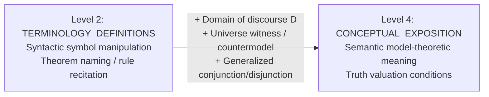
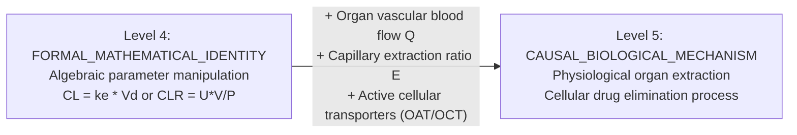
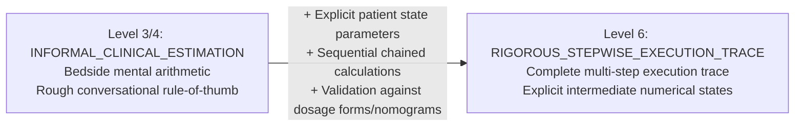
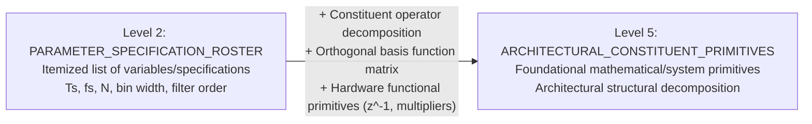

# Milestone v3.6 Step 2A — Phase 5A: Revised Error-Analysis Protocols & Operationalized Rubrics

**Document Version:** `1.1.0-frozen`  
**Preceding Baseline:** `1.0.0-frozen` (SHA-256: `79e4e238a8587e809dd2f8b27430cdc63d3a14b7f4cd42da366c32c085f032a1`)  
**Timestamp:** `2026-10-02T10:25:00Z`  
**Status:** Cryptographically Sealed Prior to Phase 5B Validation Review  
**Milestone:** Milestone v3.6 Step 2A (Diagnostic Investigation — Phase 5A Standard Freeze)

---

## 1. Governance, Audit Trail & Methodological Safeguards

This document formalizes the revised operational rubrics governing Phase 5B human validation review and Phase 6 model evaluation for Milestone v3.6 Step 2A.

### 1.1 Audit Trail & Changes Relative to v1.0.0-frozen

| Failure Pattern & Focus | Specific Operational Clarification in v1.1.0 | Methodological Rationale Grounded in Phase 4 Evidence |
| :--- | :--- | :--- |
| **Pattern 1: Logic Semantics** (`dev_2a_01`) | Explicitly defines that **model-theoretic domain expansion** (universal quantification as generalized conjunction over universe $D$, existential as disjunction, or countermodel element witness) belongs to `MEANING` (Facet: Semantic Models), distinguishing it from foundational meta-theoretic proofs (`JUSTIFICATION_WHY`). | Resolves the `TAXONOMIC_COLLISION` where P5.2A extracted domain semantics under `JUSTIFICATION_WHY` and P5.3 declared existential meaning missing under `MEANING`. |
| **Pattern 2: PK Clearance Mechanism** (`dev_2a_02`) | Explicitly restricts Level 5 in applied/biological sciences to **causal physical, biological, or cellular mechanisms** ($CL = Q \cdot E$, active transporter kinetics, podocyte filtration). Caps formal algebraic parameter derivations ($CL = k_e V_d$, urinary mass balance $CL_R = U \cdot V / P$) at Level 4 (`FORMAL_MATHEMATICAL_IDENTITY`). | Eliminates the `RUBRIC_AMBIGUITY` in the generic Level 5 prompt anchor that allowed algebraic equation manipulation to satisfy depth expectations, masking biological omissions. |
| **Pattern 3: Clinical Dosing Walkthrough** (`dev_2a_03`) | Explicitly operationalizes the boundary between **Conversational Clinical Estimation** (Level 3/4: bedside mental arithmetic, verbal dosing rules of thumb without intermediate state trace) and **Rigorous Stepwise State Execution Trace** (Level 6: $\ge 3$ sequentially chained computational steps with intermediate states, parameter checks like IBW vs actual, and commercial vial rounding). | Resolves the tension between clinical bedside heuristic practice and engineering computational traces, ensuring conversational estimation is capped at Level 3/4. |
| **Pattern 4: DSP Transforms & Primitives** (`dev_2a_04`) | Explicitly resolves the scale-dimension tension by defining that **static structural constituents, orthogonal basis function matrices, and block diagram operator primitives satisfy Level 4/5 `STRUCTURE_COMPONENTS` without requiring runtime dynamic behavior or temporal interaction** (which are strictly reserved for `RELATIONSHIPS_MECHANISM`). | Resolves the internal contradiction in P5.3 system prompt between the generic Level 4 scale anchor (requiring dynamic interaction) and the structural dimension guidance. |

---

### 1.2 Retrospective Diagnostic Invariance (Diagnostic Cases 1A–4B)

A critical methodological requirement is specifying whether the revised v1.1.0 standard alters the adjudicated consensus labels established in Phase 3 on the 8 diagnostic exploration segments:

| Package & Segment | Target Epistemic Dimension | Phase 3 Adjudicated Depth (v1.0.0) | v1.1.0 Consensus Interpretation | Diagnostic Invariance Verdict |
| :--- | :--- | :---: | :---: | :--- |
| `dev_2a_01` / `1A` (Syntax) | `MEANING` | **2** | **Level 2** (`TERMINOLOGY_DEFINITIONS_SYNTAX`) | **INVARIANT:** Pure syntactic symbol flipping without domain models remains Level 2. |
| `dev_2a_01` / `1B` (Domain Models) | `MEANING` | **4** | **Level 4** (`CONCEPTUAL_EXPOSITION_SEMANTIC_MODELS`) | **INVARIANT:** Truth conditions over finite domain $D$ are explicitly confirmed as Level 4 `MEANING`. |
| `dev_2a_02` / `2A` (Algebraic Deriv.) | `JUSTIFICATION_WHY` | **4** | **Level 4** (`FORMAL_MATHEMATICAL_IDENTITY`) | **INVARIANT:** Derivation $CL = k_e V_d$ is capped at Level 4; does not reach Level 5 biological mechanism. |
| `dev_2a_02` / `2B` (Organ Mechanism) | `RELATIONSHIPS_MECHANISM` | **5** | **Level 5** (`CAUSAL_BIOLOGICAL_MECHANISM`) | **INVARIANT:** Organ blood flow $Q$ and extraction ratio $E$ confirm Level 5 mechanism. |
| `dev_2a_03` / `3A` (Conversational) | `APPLICATION_INTERPRETATION` | **3** | **Level 3/4** (`INFORMAL_CLINICAL_ESTIMATION`) | **INVARIANT:** Bedside mental arithmetic ($5\text{ mg/kg} \times 80\text{ kg} = 400\text{ mg}$) is capped below Level 6 trace. |
| `dev_2a_03` / `3B` (5-Step Trace) | `APPLICATION_INTERPRETATION` | **6** | **Level 6** (`RIGOROUS_STEPWISE_EXECUTION_TRACE`) | **INVARIANT:** 5-step blackboard trace with units and nomogram lookup confirms Level 6. |
| `dev_2a_04` / `4A` (Parameter Roster) | `STRUCTURE_COMPONENTS` | **2** | **Level 2** (`PARAMETER_SPECIFICATION_ROSTER`) | **INVARIANT:** Scalar list of variables ($T_s, f_s, N, \Delta f$) remains Level 2. |
| `dev_2a_04` / `4B` (Basis Primitives) | `STRUCTURE_COMPONENTS` | **5** | **Level 5** (`ARCHITECTURAL_CONSTITUENT_PRIMITIVES`) | **INVARIANT:** Orthogonal Vandermonde basis matrix and projection operator confirm Level 5 structural primitives. |

**Invariance Summary:** The v1.1.0 standard introduces **zero label drift** on the 8 diagnostic segments. It formalizes and codifies the exact consensus boundaries that human annotators applied during Phase 3 adjudication, eliminating the prompt and rubric ambiguities that caused model discrepancies.

---

### 1.3 Provisional Standing of Pattern 4 Attribution

In accordance with strict attribution criteria:
- In the frozen P5.3 system prompt ([`p5_3_coverage_gap_analyzer.js`](file:///c:/Users/samanvi/OneDrive/Desktop/git_kahoot/Demo_project/experiments/experiment_5_teaching_adequacy/runner/p5_3_coverage_gap_analyzer.js)), Line 86 defines Level 4 generically as *"Dynamic interaction between two or more components, state transitions, or feedback flows"*.
- Line 99 defines `STRUCTURE_COMPONENTS` in Science/Math/CS as *"Primitives, variables, data structures, or formal terms"*.
- When P5.3 synthesized: *"C03 outlined DFT components and C06 detailed Direct Form I FIR structure, without showing interactions or dynamic behavior"*, the model was attempting to apply the Level 4 generic scale anchor.
- Under v1.0.0, the prompt lacked an explicit rule clarifying that static structural primitives satisfy Level 4/5 without dynamic interactions.
- **Attribution Verdict:** The classification of Pattern 4 as `REASONING_ERROR` remains **provisional and secondary to `RUBRIC_AMBIGUITY` / Anchor Tension**. Only if a model violates the explicit v1.1.0 rule in Phase 6 will a pure `REASONING_ERROR` attribution be deemed empirically established.

---

### 1.4 Methodological Decoupling: Human Rubric Validation vs. Model Evaluation

To prevent confounding human standard revisions with model prompt performance:
1. **Rubric Operational Validity (Phase 5B):**  
   Evaluated strictly through independent human annotations by Annotator A and Annotator B on the 8 held-back validation segments (1C–4D) under v1.1.0. High inter-annotator agreement on 1C–4D demonstrates that the revised rubric provides unambiguous operational criteria.
2. **Model Diagnostic Consistency (Phase 6):**  
   Evaluated strictly by running the baseline model and candidate prompt interventions against the frozen Phase 5B human consensus reference. A model may agree with a revised rubric while annotators still find it ambiguous, or vice versa; these two forms of validity are measured and reported separately.

---

### 1.5 Validation Corpus Exposure Declaration & Framing

- **Full Disclosure:** The corpus authors curated all segments (A, B, C, D) across `dev_2a_01`–`dev_2a_04` during Phase 1. The transcripts, topic descriptions, and intended boundary distinctions for Segments 1C–4D existed prior to Phase 5A drafting.
- **Methodological Consequence:** **Phase 6 is strictly a targeted development consistency check on held-back examples**, and **never an independent or blind validation**.

---

### 1.6 Predeclared 5-Point Adoption Decision Rule

For any candidate intervention evaluated in Phase 6:
1. **Isolated Segment Evaluation:** Each of the 8 validation segments (1C–4D) is evaluated individually.
2. **Dual Metric Reporting:** Report raw counts and percentages separately for both (a) Exact Depth Concordance and (b) Boundary Decision Agreement.
3. **Mandatory 2/2 Boundary Correctness:** The intervention must achieve **2/2 boundary correctness** on both its targeted validation cases (correctly classifying the negative case as falling short AND the positive case as satisfying the boundary).
4. **Strict Zero-Regression Gate on Known Diagnostic Cases:** The intervention version must **NOT** introduce any new misclassification or regression on the 8 previously evaluated diagnostic segments (1A–4B). If a previously correct diagnostic segment regresses, the candidate intervention is **REJECTED**.
5. **Raw Counts Reporting:** All outcomes must be reported as raw counts (e.g., $2/2$, $1/2$) alongside percentages, acknowledging the small sample size ($N=2$ per pattern, $N=8$ overall).

---

## 2. Operational Rubric 1: Conceptual Meaning vs. Static Formal Notation



### 2.1 Canonical Epistemic Dimension
- **Universal Dimension:** `MEANING`
- **Facet:** Semantic Model Intuition vs. Formal Symbolic Syntax
- **Target Boundary:** Level 2 (`TERMINOLOGY_DEFINITIONS_SYNTAX`) vs. Level 4 (`CONCEPTUAL_EXPOSITION_SEMANTIC_MODELS`)
- **Diagnostic Set (`dev_2a_01`):**
  - *Segment 1A (Diagnostic Negative):* Syntactic symbol flipping ($
eg \forall x P(x) \equiv \exists x 
eg P(x)$) $
ightarrow$ **Level 2**
  - *Segment 1B (Diagnostic Positive):* Domain model interpretation (conjunction over domain $D$, witness elements) $
ightarrow$ **Level 4**
  - *Segment 1C (Validation Negative):* Nested quantifier syntactic manipulation (Skolem dependency rule without models) $
ightarrow$ **Level 2/3 Target**
  - *Segment 1D (Validation Positive):* Nested quantifier domain model counterexample ($\mathbb{R}$ additive inverse model) $
ightarrow$ **Level 4 Target**

### 2.2 Observational Criteria
- **Positive Evidence for Level 4 (`CONCEPTUAL_EXPOSITION_SEMANTIC_MODELS`):**
  - Text explicitly references the **domain of discourse ($D$)**, **universe of elements**, or **truth valuation under an interpretation**.
  - Text grounds quantifier semantics in generalized propositional operators (e.g., universal quantification as generalized conjunction $\bigwedge_{x \in D} P(x)$, negating into disjunction $\bigvee_{x \in D} \neg P(x)$).
  - Text constructs a concrete model or counterexample demonstrating truth-value behavior across domain elements.
- **Negative Counter-Indicators (Constraining to Level 2 `TERMINOLOGY_DEFINITIONS_SYNTAX`):**
  - Reciting symbol transformation rules without truth conditions ("to negate, move the negation inside, flip for-all to there-exists").
  - Mechanical procedural instructions devoid of domain elements or valuations.
- **Borderline Rule (Level 3 Conversational Intermediate):**
  - Natural language informal paraphrase without formal domain expansion ("if not all students passed, that means someone failed") scores **Level 3** (`INTERMEDIATE_EXPLANATION`). To reach Level 4, the explanation must connect to generalized conjunction/disjunction or model truth conditions.
- **Ontological Boundary Rule (Taxonomic Separation):**
  - Defining truth conditions over domain elements belongs to `MEANING`. Foundational meta-theoretic proofs (e.g., Gödel completeness, soundness proofs) belong to `JUSTIFICATION_WHY`.

### 2.3 Matched Anchor Examples
- **Clear Positive Example (Level 4):**
  > *"Consider a domain $D = \{1, 2, 3\}$. The universal statement $\forall x P(x)$ is the conjunction $P(1) \land P(2) \land P(3)$. By classical logic, negating this conjunction yields $\neg P(1) \lor \neg P(2) \lor \neg P(3)$, which means there exists at least one witness in $D$ where $P(x)$ fails. Thus negation flips the quantifier because conjunction and disjunction are boolean duals over the domain."*
- **Clear Negative Example (Level 2):**
  > *"De Morgan's law for quantifiers states that $\neg \forall x P(x) \equiv \exists x \neg P(x)$. Whenever a negation passes through a universal quantifier, the symbol flips into an existential quantifier, and the negation attaches directly to the predicate."*

---

## 3. Operational Rubric 2: Mathematical Identity vs. Empirical Mechanism



### 3.1 Canonical Epistemic Dimension
- **Universal Dimension:** `JUSTIFICATION_WHY` / `RELATIONSHIPS_MECHANISM`
- **Facet:** Algebraic Parameter Manipulation vs. Causal Biological Mechanism
- **Target Boundary:** Level 4 (`FORMAL_MATHEMATICAL_IDENTITY`) vs. Level 5 (`CAUSAL_BIOLOGICAL_MECHANISM`)
- **Diagnostic Set (`dev_2a_02`):**
  - *Segment 2A (Diagnostic Negative):* Algebraic derivation $CL = k_e V_d$ from first-order differential rates $
ightarrow$ **Level 4**
  - *Segment 2B (Diagnostic Positive):* Organ extraction mechanism $CL = Q \cdot E$, perfusion limits, intrinsic enzyme clearance $
ightarrow$ **Level 5**
  - *Segment 2C (Validation Negative):* Formal urinary mass-balance excretion equation $CL_R = (U \cdot V) / P$ $
ightarrow$ **Level 4 Target**
  - *Segment 2D (Validation Positive):* Nephron cellular transport biology (filtration barrier, active OAT/OCT carrier secretion, reabsorption) $
ightarrow$ **Level 5 Target**

### 3.2 Observational Criteria
- **Positive Evidence for Level 5 (`CAUSAL_BIOLOGICAL_MECHANISM`):**
  - Text articulates the **physical, anatomical, or cellular structures** mediating elimination (e.g., organ blood flow $Q$, capillary extraction ratio $E$, glomerular filtration barrier, active transport proteins OAT/OCT, enzymatic metabolic clearance).
  - Text explains *how* the biological substrate accomplishes removal physically (e.g., perfusion-limited vs. capacity-limited kinetics, ATP-dependent transport against concentration gradients).
- **Negative Counter-Indicators (Constraining to Level 4 `FORMAL_MATHEMATICAL_IDENTITY`):**
  - Deriving clearance strictly through algebraic manipulation of kinetic parameters ($CL = k_e V_d$, $t_{1/2} = 0.693 / k_e$) without physiological organs.
  - Formulating excretion through urinary mass-balance identities ($CL_R = (U \cdot V) / P$) without cellular transport mechanisms.
- **Borderline Rule (Level 4 Intermediate):**
  - Mentioning organ names in a phenomenological description ("the liver and kidneys clear the drug") without detailing perfusion mechanics ($Q \cdot E$) or cellular transport mechanisms scores **Level 4** (`PHENOMENOLOGICAL_EXPLANATION`). It does **NOT** reach Level 5.

### 3.3 Matched Anchor Examples
- **Clear Positive Example (Level 5):**
  > *"Organ clearance depends on organ blood perfusion $Q$ and extraction ratio $E = (C_{in} - C_{out}) / C_{in}$. In the kidney, clearance is the vector sum of passive glomerular filtration through fenestrated capillaries ($f_u \cdot GFR$), active carrier-mediated secretion by basolateral OAT1/3 transporters, and pH-dependent passive reabsorption across tubular epithelium."*
- **Clear Negative Example (Level 4):**
  > *"Assuming first-order elimination, rate of elimination is $k_e \cdot Ab$. Because drug amount $Ab$ equals plasma concentration $C_p$ times $V_d$, we equate $CL \cdot C_p = k_e \cdot V_d \cdot C_p$. Canceling $C_p$ yields $CL = k_e \cdot V_d$."*

---

## 4. Operational Rubric 3: Worked Application vs. Conversational Clinical Estimation



### 4.1 Canonical Epistemic Dimension
- **Universal Dimension:** `APPLICATION_INTERPRETATION`
- **Facet:** Conversational Clinical Estimation vs. Rigorous Stepwise Execution Trace
- **Target Boundary:** Level 3/4 (`INFORMAL_CLINICAL_ESTIMATION`) vs. Level 6 (`RIGOROUS_STEPWISE_EXECUTION_TRACE`)
- **Diagnostic Set (`dev_2a_03`):**
  - *Segment 3A (Diagnostic Negative):* Conversational verbal walkthrough of gentamicin (mental math 5 mg/kg for 80 kg patient) $
ightarrow$ **Level 3/4**
  - *Segment 3B (Diagnostic Positive):* Rigorous 5-step blackboard trace (IBW, Cockcroft-Gault, target dose, nomogram interval) $
ightarrow$ **Level 6**
  - *Segment 3C (Validation Negative):* Conversational verbal walkthrough of phenytoin loading dose (bedside mental rounding) $
ightarrow$ **Level 3/4 Target**
  - *Segment 3D (Validation Positive):* Rigorous 7-step AUC-guided vancomycin trace (target AUC, $k_e$, $V_d$, clearance, daily dose, vial rounding, predicted AUC) $
ightarrow$ **Level 6 Target**

### 4.2 Observational Criteria
- **Positive Evidence for Level 6 (`RIGOROUS_STEPWISE_EXECUTION_TRACE`):**
  - At least **three sequentially chained computational steps**, where the numerical output of step $i$ directly feeds as input into step $i+1$.
  - Explicit intermediate numerical values and physical units ($kg$, $mL/min$, $mg$, $hours$) articulated at each step.
  - Execution includes parameter validation (e.g., actual vs. ideal body weight check), commercial dosage vial rounding, or interval nomogram lookup.
- **Negative Counter-Indicators (Constraining to Level 3/4 `INFORMAL_CLINICAL_ESTIMATION`):**
  - Single-step mental multiplication delivered conversationally without intermediate state trace ("give 5 mg/kg for an 80 kg patient, so 400 mg").
  - Stating a final recommended dose without calculating the intermediate pharmacokinetic stages.
  - Vague qualitative adjustments ("if creatinine is elevated, stretch out the interval") without recalculating the interval.
- **Borderline Rule (Level 4/5 Intermediate):**
  - Calculating a single formula with numbers ($CrCl = (140-65) \times 70 / (72 \times 1.2) = 60.7\text{ mL/min}$) but jumping directly to an uncalculated dose scores **Level 4** (`SINGLE_EQUATION_EVALUATION`). Level 6 strictly requires the full multi-step chained calculation trace.

### 4.3 Matched Anchor Examples
- **Clear Positive Example (Level 6):**
  > *"Step 1: Patient is 65yo male, height 5'10\", weight 85 kg, S_cr = 1.4 mg/dL. Step 2: IBW = 50 + 2.3*(10) = 73 kg. 85/73 = 116%, so use IBW = 73 kg. Step 3: CrCl = ((140 - 65) * 73) / (72 * 1.4) = 5475 / 100.8 = 54.3 mL/min. Step 4: Target dose = 7 mg/kg * 73 kg = 511 mg, rounded to 500 mg. Step 5: For CrCl 54 mL/min, Hartford nomogram dictates tau = 36 h. Final regimen: Gentamicin 500 mg IV q36h."*
- **Clear Negative Example (Level 3/4):**
  > *"On rounds, you see an 80 kg patient with sepsis. You typically do about 5 mg per kilogram, so that's 400 mg once daily. If their renal function looks a bit sluggish, maybe creatinine 1.8, you'd stretch that to every 36 or 48 hours."*

---

## 5. Operational Rubric 4: Structural Primitives vs. Parameter Listing



### 5.1 Canonical Epistemic Dimension
- **Universal Dimension:** `STRUCTURE_COMPONENTS`
- **Facet:** Parameter Specification Roster vs. System Architectural Primitives
- **Target Boundary:** Level 2 (`PARAMETER_SPECIFICATION_ROSTER`) vs. Level 5 (`ARCHITECTURAL_CONSTITUENT_PRIMITIVES`)
- **Diagnostic Set (`dev_2a_04`):**
  - *Segment 4A (Diagnostic Negative):* DFT parameter roster ($T_s, f_s, N, T_0, \Delta f, k$) $
ightarrow$ **Level 2**
  - *Segment 4B (Diagnostic Positive):* DFT structural primitives (Vandermonde basis matrix $W_N$, inner-product projection, inverse synthesis) $
ightarrow$ **Level 5**
  - *Segment 4C (Validation Negative):* FIR filter specification parameter roster ($M, \omega_p, \omega_s, \delta_p, A_s$) $
ightarrow$ **Level 2 Target**
  - *Segment 4D (Validation Positive):* FIR Direct Form I hardware signal flow architecture (tapped delay line $z^{-1}$, coefficient multipliers $b_k$, adder accumulation tree) $
ightarrow$ **Level 5 Target**

### 5.2 Observational Criteria & Scale-Dimension Tension Resolution Rule
- **The Scale-Dimension Tension Resolution Invariant:**  
  *Static architectural constituent primitives, orthogonal basis function matrices, and hardware block diagrams satisfy Level 4/5 `STRUCTURE_COMPONENTS` without requiring runtime dynamic behavior or temporal interaction.* Dynamic operational behavior and signal flow execution belong strictly to `RELATIONSHIPS_MECHANISM`.
- **Positive Evidence for Level 5 (`ARCHITECTURAL_CONSTITUENT_PRIMITIVES`):**
  - Text specifies the **internal constituent primitives** and their **architectural decomposition or structural composition** (e.g., orthogonal basis matrix $W_N$, inner-product projection operator, inverse synthesis operator, tapped delay line memory registers $z^{-1}$, coefficient multipliers $b_k$, adder tree).
  - Text details the structural blueprint of the system or operator.
- **Negative Counter-Indicators (Constraining to Level 2 `PARAMETER_SPECIFICATION_ROSTER`):**
  - Itemizing scalar parameters, tuning variables, or specification bounds ($T_s, f_s, N, \Delta f, M, \omega_p, A_s$) without structural component decomposition.
  - Presenting variable definitions as an isolated glossary or variable table.
- **Borderline Rule (Level 3/4 Intermediate):**
  - A mathematical difference equation ($y[n] = \sum b_k x[n-k]$) stated algebraically without hardware primitives (delay registers, multipliers, adder tree) scores **Level 3/4** (`MATHEMATICAL_SPECIFICATION`). Level 5 requires specifying the structural/architectural constituent blocks.

### 5.3 Matched Anchor Examples
- **Clear Positive Example (Level 5):**
  > *"The FIR filter realization is defined by its Direct Form I hardware signal flow graph primitives: a tapped delay line of $M$ unit-delay memory registers $z^{-1}$ storing the state vector $[x[n], \dots, x[n-M]]$, a bank of $M+1$ coefficient multipliers scaling each tap by $b_k$, and an adder tree summing all products to generate $y[n]$."*
- **Clear Negative Example (Level 2):**
  > *"When specifying an FIR filter, engineers define: filter length $M$, passband cutoff $\omega_p$, stopband frequency $\omega_s$, transition bandwidth $\Delta \omega$, passband ripple $\delta_p$, and stopband attenuation $A_s$."*

---

## 6. Cryptographic Manifest & Freeze Verification

This document is cryptographically sealed as Version `1.1.0-frozen`.

```
Document: dev_2a/step2a_error_operationalization_rubrics_v1_1_0.md
Preceding Baseline: dev_2a/step2a_error_operationalization_rubrics.md (v1.0.0-frozen)
Preceding Hash: 79e4e238a8587e809dd2f8b27430cdc63d3a14b7f4cd42da366c32c085f032a1
```
