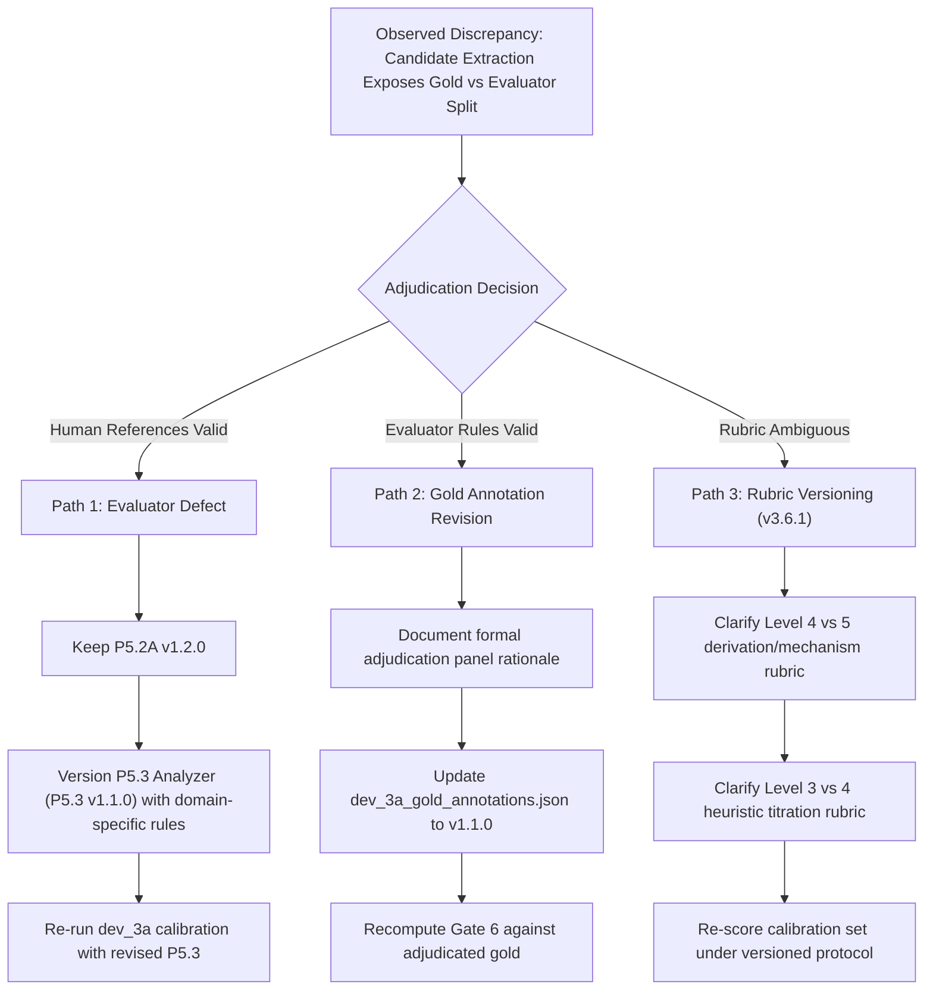

# Milestone v3.6 Phase 8: Gate 6 Calibration Adjudication Dossier
**Corpus:** `dev_3a` Calibration Set  
**Date:** 2026-10-03  
**Status:** Frozen Evidence Record — Gate 6 Failed (2 Regressions, Repeatability Divergence)  
**Evaluator:** Frozen P5.3 Coverage Gap Analyzer (`MAX_COMPLETION_TOKENS = 2200`, `T = 0.0`)  
**Extractor Candidate:** P5.2A Topic Reconstructor v1.2.0  

---

## 1. Executive Summary & Frozen Evidence Inventory

Following the user directive, all calibration and extraction artifacts from Phase 8 have been preserved without overwriting baseline records or gold annotations:
1. **Candidate P5.2A v1.2.0 Extraction Output:**  
   `experiments/experiment_5_teaching_adequacy/dev_3a/calibration_corpus/p5_2a_candidate_dev3a_concepts_v1_2_0.json` (84,200 bytes, 16 segments, SPF = 100%, EERA = 36.36%, Recall = 78.79%).
2. **Frozen P5.3 Diagnostic Evaluation Output (16 Segments):**  
   `experiments/experiment_5_teaching_adequacy/dev_3a/calibration_corpus/p5_3_candidate_dev3a_results_v1_2_0.json` (16 segments scored).
3. **Immutable Frozen Baseline Records:**  
   `experiments/experiment_5_teaching_adequacy/dev_3a/calibration_corpus/p5_3_baseline_dev3a_results.json` (untouched).  
   `experiments/experiment_5_teaching_adequacy/dev_3a/calibration_corpus/p5_2a_baseline_dev3a_concepts.json` (untouched).  
   `experiments/experiment_5_teaching_adequacy/dev_3a/gold_annotations/dev_3a_gold_annotations.json` (untouched).
4. **Targeted Repeatability Raw Passes (Pass 1 & Pass 2):**  
   `experiments/experiment_5_teaching_adequacy/scratch/repeatability_candidate_v1_2_0_pass1.json`  
   `experiments/experiment_5_teaching_adequacy/scratch/repeatability_candidate_v1_2_0_pass2.json`

---

## 2. Gate 6 Diagnostic Performance Matrix (`dev_3a`)

| Seg | Split | Target Dimension | Threshold | Gold Ref | Base Obs | Cand Obs | Base Depth | Cand Depth | Base Bnd | Cand Bnd | Gate 6 Classification |
| :---: | :---: | :---: | :---: | :---: | :---: | :---: | :---: | :---: | :---: | :---: | :---: |
| **1A** | DIAG | `MEANING` | 4 | 2 | 2 | **2** | MATCH | **MATCH** | MATCH | **MATCH** | **CLEAN** |
| **1B** | DIAG | `MEANING` | 4 | 4 | 3 | **3** | MISMATCH | MISMATCH | MISMATCH | MISMATCH | **CLEAN** |
| **2A** | DIAG | `JUSTIFICATION_WHY` | 5 | 4 | 0 | **5** | MISMATCH | MISMATCH | MATCH | MISMATCH | **BOUNDARY_REGRESSION** |
| **2B** | DIAG | `JUSTIFICATION_WHY` | 5 | 5 | 0 | **5** | MISMATCH | **MATCH** | MISMATCH | **MATCH** | **CLEAN (Recovery 0 $\rightarrow$ 5)** |
| **3A** | DIAG | `APPLICATION_INTERPRETATION` | 6 | 3 | 3 | **4** | MATCH | MISMATCH | MATCH | **MATCH** | **DEPTH_REGRESSION** |
| **3B** | DIAG | `APPLICATION_INTERPRETATION` | 6 | 6 | 6 | **6** | MATCH | **MATCH** | MATCH | **MATCH** | **CLEAN** |
| **4A** | DIAG | `STRUCTURE_COMPONENTS` | 5 | 2 | 2 | **2** | MATCH | **MATCH** | MATCH | **MATCH** | **CLEAN** |
| **4B** | DIAG | `STRUCTURE_COMPONENTS` | 5 | 5 | 4 | **4** | MISMATCH | MISMATCH | MISMATCH | MISMATCH | **CLEAN** |

- **Exact-Depth Concordance:** $7 / 16$ ($43.8\%$)
- **Boundary Concordance:** $9 / 16$ ($56.3\%$)
- **Gate 6 Diagnostic Regressions ($\sum \text{Regressions}$):** **2** (Target: 0).
- **Formal Status:** **GATE 6 FAILED.** Stage 5 (`dev_3b` Challenge) remains sealed.

---

## 3. Targeted Repeatability Check Outcome

The targeted repeatability evaluation (`task-9855`) was conducted on sensitive calibration cases under greedy decoding ($T = 0.0$):

- **Case 1A (`MEANING`):**
  - **Pass 1:** Depth = **3**, Status = `PARTIALLY_COVERED`  
    *Evidence:* *"Derived P(∅)=0 and the complement rule from the axioms, but no multi-variable or systemic interaction was demonstrated."*
  - **Pass 2:** Depth = **2**, Status = `ACTIONABLE_COVERAGE_GAP`  
    *Evidence:* *"Only static definitions were provided; the lecture did not explain the systemic significance or interpretive meaning of the axioms beyond surface description."*
  - **Result:** **NON-DETERMINISTIC DIVERGENCE (Depth 3 vs 2)**. Full-matrix identity failed.
- **Finding:** Even under $T = 0.0$, subtle multi-node execution variations across Groq inference clusters produce boundary flipping when an input sits at the exact margin between descriptive definition (Level 2) and deductive univariate deduction (Level 3). Universal determinism cannot be assumed.

---

## 4. Independent Case Adjudication

### Case 1: Segment 2A — Algebraic Mass-Balance Clearance Derivation
- **Package:** `dev_3a_02_renal_pharmacokinetics`
- **Target Dimension:** `JUSTIFICATION_WHY`
- **Target Threshold:** 5 (`REQUIRED`)
- **Lecture Transcript Evidence:**
  > *"Renal clearance is derived from the fundamental principle of mass conservation across the kidney. Under steady-state conditions, the rate of drug entering the renal artery equals the rate of drug exiting through the renal vein plus the rate of drug excreted in the urine. The urinary excretion rate is defined as the product of urine concentration C-u and urine flow rate V. By definition, renal clearance CL-R represents the virtual volume of plasma cleared of drug per unit time. Therefore, the rate of drug clearance from plasma, which is CL-R multiplied by plasma concentration C-p, must equal the urinary excretion rate: CL-R times C-p equals C-u times V. Dividing both sides algebraically by plasma concentration C-p yields the standard clearance formula: CL-R equals C-u times V divided by C-p. This algebraic derivation proves that renal clearance is directly proportional to urinary excretion and inversely proportional to plasma concentration under linear kinetics."*

#### Neutral Comparative Analysis
| Attribute | Human Gold Reference | Frozen P5.3 Evaluator (on v1.2.0) |
| :--- | :--- | :--- |
| **Assigned Level** | **Level 4** | **Level 5** |
| **Resulting Boundary** | `FALLS_SHORT` ($4 < 5$) | `SATISFIES` ($5 \ge 5$) |
| **Recorded Rationale** | *"Formal algebraic mass-balance derivation (Level 4), but zero biological cellular mechanism."* | *"C05 provides a step-by-step algebraic derivation of CL_R = (C_u·V)/C_p."* |
| **Applicable Rubric Rule** | Implicit domain hierarchy: in pharmacology/physiology, causal rationale requires cellular biological transport (transporters, membranes), while algebraic manipulation is subordinate. | Explicit literal rule (Rule 52): *"Level 5 (Substantive Derivation / Formal Proof / Rationale): Step-by-step mathematical proof, algebraic derivation, formal invariant maintenance..."* |
| **The Baseline Artifact** | Baseline scored **0** because it omitted derivation concepts. Since $0 < 5$, Baseline matched `FALLS_SHORT` purely by omission. | Candidate faithfully extracted the derivation, prompting P5.3 to apply Rule 52, causing an overshoot against Gold. |

#### Core Rubric Gap
Does a formal, step-by-step algebraic derivation of a physical/pharmacokinetic law qualify as Level 5 across all disciplines, or does Level 5 in empirical biological sciences strictly require physiological/cellular mechanism (reserving Level 4 for dimensional/algebraic derivations)?

---

### Case 2: Segment 3A — Bedside Vasopressor Rule-of-Thumb Estimation
- **Package:** `dev_3a_03_critical_care_infusions`
- **Target Dimension:** `APPLICATION_INTERPRETATION`
- **Target Threshold:** 6 (`REQUIRED`)
- **Lecture Transcript Evidence:**
  > *"In the intensive care unit, when an adult septic shock patient has a mean arterial pressure dropping below 65 mmHg, we perform a rapid bedside estimation for norepinephrine infusion. For an average patient weighing approximately 70 kilograms, our standard starting protocol calls for a dose of 0.1 micrograms per kilogram per minute. Rather than calculating full unit conversions on paper, nurses use the classic rule of thumb: with a standard concentration bag of 4 milligrams in 250 millilitres of dextrose, 0.1 micrograms per kilogram per minute translates approximately to about 15 to 25 millilitres per hour on the infusion pump. We punch 15 millilitres per hour directly into the smart pump interface as our starting rate. We glance at the bedside monitor every five minutes, and if the mean arterial pressure remains sluggish, we bump the pump up by 5 millilitres per hour increments until the blood pressure stabilizes. This informal bedside rule provides rapid medication delivery without tracing multi-step mathematical derivations."*

#### Neutral Comparative Analysis
| Attribute | Human Gold Reference | Frozen P5.3 Evaluator (on v1.2.0) |
| :--- | :--- | :--- |
| **Assigned Level** | **Level 3** | **Level 4** |
| **Resulting Boundary** | `FALLS_SHORT` ($3 < 6$, MATCH) | `FALLS_SHORT` ($4 < 6$, MATCH) |
| **Depth Concordance** | MATCH in Baseline ($3 == 3$) | MISMATCH in Candidate ($4 \ne 3$, Regression) |
| **Recorded Rationale** | *"Informal bedside starting rate estimation (Level 3 single calculation)... single-step bedside heuristic calculation without formal multi-step trace."* | Recognizes dynamic closed feedback loop: weight (70kg) + starting rate (15mL/hr) + 5-min monitoring + 5mL/hr titration feedback. |
| **Applicable Rubric Rule** | Rule 50: *"Level 3 (Univariate Operational Step): Explicitly explained operational step, single cause-and-effect relationship, or sequential procedural rule."* | Rule 51: *"Level 4 (Systemic Interaction / Multi-Variable Dynamics): Dynamic interaction between two or more components, state transitions, or feedback flows."* |
| **The Baseline Artifact** | Baseline extracted an incomplete concept set, missing the iterative monitoring loop, resulting in Level 3. | Candidate v1.2.0 extracted the full titration feedback loop (C05), triggering P5.3's "feedback flow" clause for Level 4. |

#### Core Rubric Gap
Does an empirical, clinical bedside rule-of-thumb involving periodic adjustment ("monitor every 5 min, bump 5 mL/hr") qualify as a "feedback flow" under Level 4, or does Level 4 require multi-variable interaction models, leaving empirical clinical heuristics at Level 3?

---

## 5. Strategic Remedy Framework

1. **Path 1 (Evaluator Defect / P5.3 Calibration Update):**
   - Human ratings are reaffirmed: 2A is Level 4 (because cellular biology is required for Level 5 in medical subjects); 3A is Level 3 (heuristic titration is not systemic dynamic interaction).
   - *Action:* P5.2A v1.2.0 extraction is preserved as correct. A versioned update to the analyzer (`p5_3_coverage_gap_analyzer_v1_1_0.js`) is constructed with explicit domain-aware calibration directives.
2. **Path 2 (Gold Annotation Revision via Formal Adjudication):**
   - The evaluator's literal interpretation is reaffirmed: 2A's algebraic derivation strictly satisfies the Level 5 definition; 3A's closed feedback loop strictly satisfies Level 4.
   - *Action:* Gold annotations for 2A and 3A are formally updated in `dev_3a_gold_annotations_v1_1_0.json` with an audit trail, and Gate 6 is recomputed.
3. **Path 3 (Rubric Harmonization & Versioning):**
   - The rubric definitions themselves are clarified so that all raters (human and machine) operate on identical disambiguation rules before evaluating regressions.

---

## 6. Pre-Declared Protocol Invariant

> [!IMPORTANT]
> **Stage 5 (`dev_3b` Challenge) remains strictly sealed.** Under the pre-declared protocol, any future challenge run must occur under an established, frozen calibration baseline, not retroactively applied to unadjudicated discrepancies.
