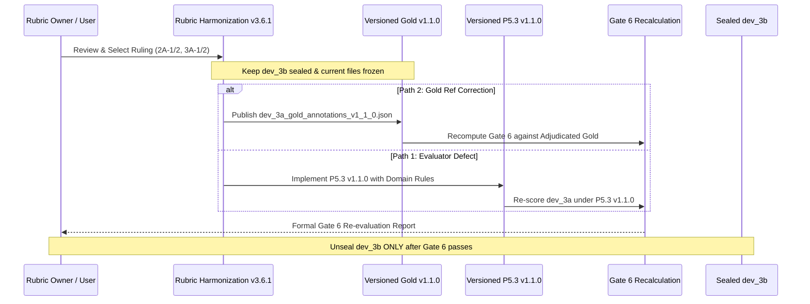

# Rubric Harmonization Proposal & Adjudication Framework (v3.6.1)
**Milestone:** v3.6 Phase 8 Calibration Remediation  
**Status:** In Review — Awaiting Formal Rubric Owner Rulings  
**Corpus State:** `dev_3a` Calibration Set (Gold Annotations & Baseline Untouched; `dev_3b` Sealed)  

---

## 1. Context & Operational Protocol

Following the user directive, we adopt **Path 3: Rubric Harmonization First**. 

We do not modify candidate extractor P5.2A v1.2.0 to suppress valid extracted evidence, nor do we alter gold reference labels or the frozen P5.3 evaluator prior to a formal ruling. The Gate 6 failure on Candidate v1.2.0 remains an immutable historic finding under the original baseline and protocol.

This document presents the formal text, evidence, and provisional rulings for the Rubric Owner to adjudicate the two calibration regression cases (`2A` and `3A`), while formally logging the repeatability finding on `1A` as **undetermined**.

---

## 2. Formal Adjudication Items for the Rubric Owner

### Case 2A: Segment `2A` — *Algebraic Mass-Balance Clearance Derivation*
* **Package:** `dev_3a_02_renal_pharmacokinetics`
* **Target Dimension:** `JUSTIFICATION_WHY` | **Target Threshold:** 5 (`REQUIRED`)
* **Transcript Passage:**
  > *"Renal clearance is derived from the fundamental principle of mass conservation across the kidney. Under steady-state conditions, the rate of drug entering the renal artery equals the rate of drug exiting through the renal vein plus the rate of drug excreted in the urine. The urinary excretion rate is defined as the product of urine concentration C-u and urine flow rate V. By definition, renal clearance CL-R represents the virtual volume of plasma cleared of drug per unit time. Therefore, the rate of drug clearance from plasma, which is CL-R multiplied by plasma concentration C-p, must equal the urinary excretion rate: CL-R times C-p equals C-u times V. Dividing both sides algebraically by plasma concentration C-p yields the standard clearance formula: CL-R equals C-u times V divided by C-p. This algebraic derivation proves that renal clearance is directly proportional to urinary excretion and inversely proportional to plasma concentration under linear kinetics."*

#### Provisional Interpretation & Rule Analysis
* **Published Rule 52 (P5.3 Prompt):**
  > *"Level 5 (Substantive Derivation / Formal Proof / Rationale): Step-by-step mathematical proof, algebraic derivation, formal invariant maintenance, or causal necessity argument. (Reciting a formula without derivation is Level 1-2)."*
* **Analysis:**
  Rule 52 explicitly and unconditionally includes *"step-by-step... algebraic derivation"*. The transcript provides a complete 5-step algebraic derivation of the renal clearance equation ($CL_R = \frac{C_u \cdot V}{C_p}$) from first principles of steady-state conservation of mass. 
  The existing human gold rating of **Level 4** relied on an uncodified domain criterion: *"Formal algebraic mass-balance derivation (Level 4), but zero biological cellular mechanism."* That restriction—demanding cellular/biological mechanisms for Level 5 in medical topics—does not exist in the published rubric.

#### Decision Required from Rubric Owner for Case 2A:
* **Option 2A-1 (Adjudicate Gold as Inconsistent with Published Rule):**
  Confirm that Rule 52 applies universally. A complete algebraic derivation from physical conservation laws satisfies Level 5 regardless of academic discipline. 
  *Action:* Re-label Segment 2A reference depth to **Level 5** (`SATISFIES`) in a versioned `dev_3a_gold_annotations_v1_1_0.json`.
* **Option 2A-2 (Codify Domain-Specific Mechanistic Restriction in Rubric):**
  Determine that the intended pedagogy of empirical physiological sciences requires cellular/molecular mechanisms for Level 5 `JUSTIFICATION_WHY`, and that dimensional/algebraic derivations are capped at Level 4.
  *Action:* Formally amend the Rubric Domain Guidance (publishing Rubric v3.6.1) and version a P5.3 evaluator update (`P5.3 v1.1.0`) to incorporate this domain rule.

---

### Case 3A: Segment `3A` — *Bedside Vasopressor Rule-of-Thumb Estimation*
* **Package:** `dev_3a_03_critical_care_infusions`
* **Target Dimension:** `APPLICATION_INTERPRETATION` | **Target Threshold:** 6 (`REQUIRED`)
* **Transcript Passage:**
  > *"In the intensive care unit, when an adult septic shock patient has a mean arterial pressure dropping below 65 mmHg, we perform a rapid bedside estimation for norepinephrine infusion. For an average patient weighing approximately 70 kilograms, our standard starting protocol calls for a dose of 0.1 micrograms per kilogram per minute. Rather than calculating full unit conversions on paper, nurses use the classic rule of thumb: with a standard concentration bag of 4 milligrams in 250 millilitres of dextrose, 0.1 micrograms per kilogram per minute translates approximately to about 15 to 25 millilitres per hour on the infusion pump. We punch 15 millilitres per hour directly into the smart pump interface as our starting rate. We glance at the bedside monitor every five minutes, and if the mean arterial pressure remains sluggish, we bump the pump up by 5 millilitres per hour increments until the blood pressure stabilizes. This informal bedside rule provides rapid medication delivery without tracing multi-step mathematical derivations."*

#### Provisional Interpretation & Rule Analysis
* **Published Rule 51 (P5.3 Prompt):**
  > *"Level 4 (Systemic Interaction / Multi-Variable Dynamics): Dynamic interaction between two or more components, state transitions, or feedback flows."*
* **Published Rule 50 (P5.3 Prompt):**
  > *"Level 3 (Univariate Operational Step): Explicitly explained operational step, single cause-and-effect relationship, or sequential procedural rule."*
* **Analysis:**
  The transcript describes a multi-variable operational setup (patient weight 70 kg, starting rate 15 mL/hr, concentration 4 mg / 250 mL) coupled with a closed monitoring feedback loop (*"glance at the bedside monitor every five minutes, and if MAP remains sluggish, bump pump by 5 mL/hr until blood pressure stabilizes"*).
  Under Rule 51, this is literally a *"feedback flow"*. 
  However, the human annotator rated this at **Level 3**, reasoning that an informal "rule of thumb" titration without mathematical pharmacokinetic derivation is merely an operational procedure.

#### Decision Required from Rubric Owner for Case 3A:
* **Option 3A-1 (Adjudicate Gold as Inconsistent with Published Rule):**
  Confirm that repeated monitoring coupled with parameter adjustment in response to state transitions constitutes a feedback flow under Level 4.
  *Action:* Re-label Segment 3A reference depth to **Level 4** (`FALLS_SHORT`) in a versioned `dev_3a_gold_annotations_v1_1_0.json`. (Note: Threshold is 6, so Boundary remains `FALLS_SHORT` in both cases).
* **Option 3A-2 (Codify Empirical Rule-of-Thumb Restriction in Rubric):**
  Clarify that informal bedside titration heuristics without formal kinetic modeling or multi-variable equations remain Level 3 (Univariate Operational Step).
  *Action:* Formally amend Rubric Domain Guidance (Rubric v3.6.1) to state that heuristic clinical titration loops without formal state-transition models are Level 3, and version a P5.3 evaluator update.

---

## 3. Repeatability Finding on Segment 1A

* **Empirical Observation:**
  During the targeted repeatability test on Candidate v1.2.0 inputs on Segment `1A` (`MEANING`) under greedy decoding ($T = 0.0$):
  - Pass 1: Depth = 3, Status = `PARTIALLY_COVERED`
  - Pass 2: Depth = 2, Status = `ACTIONABLE_COVERAGE_GAP`
* **Formal Technical Status:**
  The output variation is confirmed and logged in the raw passes. In strict compliance with scientific standards:
  > **The precise root cause of the 1A divergence under $T = 0.0$ is recorded as UNDETERMINED.**  
  > While execution across different cluster nodes and API endpoints was observed, proving whether the variance originates from multi-node token scheduling, non-associative floating-point reductions, or internal inference routing would require low-level system profiling that is unavailable via public API endpoints.
* **Operational Impact:**
  This empirical variance confirms that inputs positioned exactly at the boundary between two depth definitions (e.g., Level 2 static description vs. Level 3 univariate deduction) are susceptible to downstream classification shifts. This further reinforces the necessity of crisp rubric disambiguation.

---

## 4. Next Sequence of Execution

1. **Step 1:** Rubric Owner reviews this proposal and records final rulings on Case 2A and Case 3A.
2. **Step 2:** Publish the versioned changes:
   - If gold labels change: Create `dev_3a_gold_annotations_v1_1_0.json` with explicit changelog.
   - If rubric/evaluator changes: Create `p5_3_coverage_gap_analyzer_v1_1_0.js` with documented domain rules.
3. **Step 3:** Recompute Gate 6 calibration concordance under the formally settled versions.
4. **Step 4:** Stage 5 (`dev_3b` Challenge) remains strictly sealed until the revised calibration gates pass cleanly.
